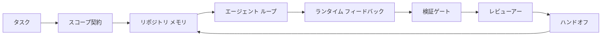

# エージェント ワークベンチ エンジニアリング: 有能なモデルがまだ失敗する理由

> 有能なモデルは十分ではありません。信頼できるエージェントはワークベンチが必要です: 指示、状態、スコープ、フィードバック、検証、レビュー、ハンドオフ。それらを取り除くと、最先端のモデルでさえ出荷するのに安全でない成果物を生成します。

**タイプ:** Learn + Build
**言語:** Python (stdlib)
**前提条件:** Phase 14 · 01 (Agent Loop)、Phase 14 · 26 (Failure Modes)
**所要時間:** 約 45 分

## 学習目標

- モデル能力を実行信頼性から分離できる。
- エージェントがシップするかどうかを決定する 7 つのワークベンチ面に名前を付けることができる。
- プロンプトのみの実行とワークベンチ ガイドの実行を小さなリポジトリ タスクで比較できる。
- 各ミス面をそれが引き起こした症状にマップする障害モード レポートを生成できる。

## 問題

あなたは最先端のモデルを実際のリポジトリに落とし、入力検証を追加するように求めます。それは 4 つのファイルを開き、もっともらしいコードを書き、成功を宣言し、停止します。テストを実行します。2 つが失敗します。3 番目のファイルに検証とは何の関係もないファイルが触れられます。エージェントが何を想定していたか、何を最初に試みたか、または何が残っているかについての記録はありません。

モデルは Python について間違っていませんでした。 仕事について間違っていました。完成として数えるもの、書く場所の許可、テストが権威であったもの、または次のセッションがどのように拾い上げることが予定されていたかについて、そのアイデアがありませんでした。

これはモデルのバグではありません。これはワークベンチのバグです。エージェント周りの面は、ワンショット生成を信頼できる再開可能なエンジニアリングに変える部分を欠いています。

## コンセプト

ワークベンチはタスク中にモデルをラップする動作環境です。 7 つの面があります:

| 面 | 何を負担するか | 欠落時の障害 |
|---------|-----------------|----------------------|
| 指示 | スタートアップ ルール、禁止されたアクション、完了の定義 | エージェント は出荷の意味を推測 |
| 状態 | 現在のタスク、触れたファイル、ブロッカー、次のアクション | 各セッションはゼロから再起動 |
| スコープ | 許可されたファイル、禁止されたファイル、受け入れ基準 | 編集は無関係なコードにリーク |
| フィードバック | 実際のコマンド出力がループにキャプチャ | エージェントは 400 での成功を宣言 |
| 検証 | テスト、lint、スモーク実行、スコープ チェック | 「見栄えが良い」 メインに到達 |
| レビュー | 異なるロールでの 2 番目のパス | ビルダー は独自の宿題をマーク |
| ハンドオフ | 何が変更されたか、なぜ、何が残っているか | 次のセッション は すべてを再発見 |

ワークベンチはモデルに依存しません。 モデルをスワップして面を保つことができます。 面をスワップして信頼性を保つことはできません。



ループはチャット履歴ではなく、状態ファイルで閉じます。チャットは揮発性です。リポジトリは記録のシステムです。

### ワークベンチ対プロンプト エンジニアリング

プロンプティングはモデルに今回あなたが何をしたいかを伝えます。ワークベンチはモデルにターンとセッション全体で作業する方法を伝えます。 ほとんどのエージェント障害ストーリーはプロンプト エンジニアリングの衣装を着ているワークベンチ障害です。

### ワークベンチ対フレームワーク

フレームワークはランタイム (LangGraph、AutoGen、Agents SDK) を提供します。ワークベンチはそのランタイム内でエージェントに作業場所を提供します。 両方が必要です。 このミニトラックは 2 番目のものについてです。

### ベンダー タクソノミーからではなくプリミティブから推論

「ハーネス エンジニアリング」についての多くの執筆があります。Addy Osmani、OpenAI、Anthropic、LangChain、Martin Fowler、MongoDB、HumanLayer、Augment Code、Thoughtworks、walkinglabs awesome リスト、および Medium と Hacker News の定期的なドラムビートはすべてそれを運んでいます。彼らはハーネスが何であるか、スコープ内にあるもの、使用する語彙の境界に意見が一致しません。 どちらかを選ぶ必要はありません。 7 つの面は UX レイヤー; すべてのワークベンチの下には、信頼できるバックエンドを支えるすべての信頼できるシステムが常に必要とする分散システムプリミティブのセットが同じです。

エージェント ラベルをしばらく外します。 エージェント実行は、時間、プロセス、マシンを横断する計算です。 それを信頼できるようにするには、任意の本番環境システムが必要とする同じプリミティブが必要です。

| プリミティブ | 何であるか | エージェント用に何を支えるか |
|-----------|------------|------------------------------|
| 関数 | 型付きハンドラー。可能な限り純粋。 入力と出力を所有。 | ツール呼び出し、ルール チェック、検証ステップ、モデル 呼び出し |
| ワーカー | 1 つ以上の関数とライフサイクルを所有する長寿命プロセス | ビルダー、レビューアー、ベリファイアー、MCP サーバー |
| トリガー | 関数を呼び出すイベント ソース | エージェント ループ ティック、HTTP リクエスト、キュー メッセージ、cron、ファイル変更、フック |
| ランタイム | どこで何を実行するか、タイムアウトとリソースで決定する境界 | Claude Code のプロセス、LangGraph のランタイム、ワーカー コンテナ |
| HTTP / RPC | 呼び出し元とワーカー間の配線 | ツール呼び出しプロトコル、MCP リクエスト、モデル API |
| キュー | トリガーとワーカー間の耐久バッファ; バックプレッシャー、再試行、べき等性 | タスク ボード、フィードバック ログ、レビュー インボックス |
| セッション永続性 | クラッシュ、再起動、モデル スワップを生き残る状態 | `agent_state.json`、チェックポイント、KV ストア、リポジトリ自体 |
| 認可ポリシー | 誰がどのスコープでどの関数を呼び出せるか | 許可/禁止ファイル、承認境界、MCP 機能リスト |

ここで 7 つのワークベンチ面をそれらのプリミティブにマップします。

- **指示** — ポリシー + 関数メタデータ。 ルールはチェック (関数)。 ルーター (`AGENTS.md`) はランタイムのスタートアップに接続されるポリシー。
- **状態** — セッション永続性。 ランタイムがすべてのステップで読むキー付きストア。 ファイル、KV、または DB; 永続性セマンティクスが重要、ストレージ バックエンド ではない。
- **スコープ** — タスクごとの認可ポリシー。 許可/禁止グロブは ACL。 必要な承認は権限ラティス。
- **フィードバック** — キューに書き込まれた呼び出しログ。 すべてのシェル呼び出しはレコード、耐久、リプレイ可能。
- **検証** — 関数。 入力上で決定論的。 タスク クローズ時にトリガー。 クローズで失敗。
- **レビュー** — ビルダー成果物で読み取り専用認可を持つ個別ワーカーと、レビュー レポートで書き込み専用認可を持つ。
- **ハンドオフ** — セッション終了トリガーで発行される耐久レコード。 次のセッションのスタートアップ トリガーがそれを読む。

エージェント ループ自体はイベント (ユーザー メッセージ、ツール 結果、タイマー ティック) を消費し、関数 (モデル、次に モデルが選択するツール) を呼び出し、レコード (状態、フィードバック) を書き込み、トリガー (検証、レビュー、ハンドオフ) を発行するワーカーです。 謎ではない; ジョブ プロセッサーと同じ形。

### 流通中のパターン、プリミティブに変換

すべての人気あるハーネス パターンは 8 つのプリミティブに減少します。 翻訳テーブル。

| ベンダーまたはコミュニティ パターン | 実際に何であるか |
|------------------------------|--------------------|
| Ralph Loop (Claude Code、Codex、agentic_harness book) — エージェント が早期に停止しようとするときに、新しいコンテキスト ウィンドウに元の意図を再注入 | タスクをクリーンなコンテキストで再キューイングするトリガー; セッション永続性は目標を先に進める |
| Plan / Execute / Verify (PEV) | 3 つのワーカー、ロールごと 1 つ、フェーズ間のステート とキュー経由で通信 |
| ハーネス計算分離 (OpenAI Agents SDK、2026 年 4 月) — 制御プレーンを実行プレーンから分割 | コントロール プレーン / データ プレーンを再述べ。 エージェント ラベルの数十年前 |
| Open Agent Passport (OAP、2026 年 3 月) — すべてのツール呼び出しに署名して実行前に宣言ポリシーに対して監査 | 実行前ワーカーで強制される認可ポリシー、署名された監査キュー付き |
| ガイドとセンサー (Birgitta Böckeler / Thoughtworks) — フィードフォワード ルール + フィードバック オブザーバビリティ | 認可ポリシー + 検証関数 + オブザーバビリティ トレース |
| 進行的圧縮、5 段階 (Claude Code リバース エンジニアリング、2026 年 4 月) | セッション永続性上でクロンのように実行して予算内に保つ状態管理ワーカー |
| フック / ミドルウェア (LangChain、Claude Code) — モデルとツール呼び出しをインターセプト | ランタイムの呼び出しパスの周りでラップされたトリガー + 関数 |
| スキルをマークダウンで段階的開示 (Anthropic、Flue) | 関数メタデータがコンテキストにジャスト イン タイムで読み込まれる関数レジストリ |
| サンドボックス エージェント (Codex、Sandcastle、Vercel Sandbox) | 計算プレーン: 分離されたファイルシステム、ネットワーク、ライフサイクルを持つランタイム |
| MCP サーバー | 機能リストを認可とする安定 RPC 経由で関数を公開するワーカー |

そのテーブルの各エントリは、エージェント コミュニティが分散システムに既に名前を持つプリミティブに到達し、新しい名前を与えています。 マーケティング用の有用なラベル; エンジニアリング語彙として有用ではない。

### レシートが実際に言うもの

ハーネス対モデル主張は今それの背後に数字があります。 それらは「スマーター モデルを待つだけ」に対する唯一の正直な議論でもあるため、知る価値があります。

- Terminal Bench 2.0 - 同じモデル、ハーネス 変更はコーディング エージェントをトップ 30 外からランク 5 に移動 (LangChain、*Anatomy of an Agent Harness*)。
- Vercel — エージェントのツールの 80% を削除; 成功率は 80% から 100% にジャンプ (MongoDB)。
- Harvey — 法律エージェント はハーネス最適化のみで精度を 2 倍以上にしました (MongoDB)。
- エンタープライズ AI エージェント プロジェクトの 88% は本番環境に到達できず。 障害はランタイム、推論ではなく集約 (preprints.org、*Harness Engineering for Language Agents*、2026 年 3 月)。
- 2025 年のベンチマーク研究では 3 つの人気あるオープンソース フレームワークにわたって約 50% タスク完了を報告; 長コンテキスト WebAgent は長コンテキスト条件で 40-50% から 10% 未満に崩壊、主に無限ループと目標損失から (2026 年初期の執筆で広く報道)。

テイクアウェイは「ハーネスが永遠に勝つ」ではありません。モデルはハーネス トリックを時間とともに吸収します。 テイクアウェイはそれが今日、負荷を支えるエンジニアリングはモデルの内部ではなくモデルの周りであり、その負荷を支えるプリミティブはすべての本番環境システムが常に必要とした同じものです。

### ベンダー執筆がどこで短くなるか

これはあなたが 礼儀正しくある必要がない部分です。

- LangChain の *Anatomy of an Agent Harness* は 11 つのコンポーネント - プロンプト、ツール、フック、サンドボックス、オーケストレーション、メモリ、スキル、サブエージェント、ランタイム「ダム ループ」を列挙。 キュー、デプロイメント ユニット としてのワーカー、トリガー セマンティクス、セッション永続性 を別の関心、または認可ポリシーに名前を付けません。 ハーネスをあなたが設定するオブジェクトとして扱い、デプロイするシステムとしては扱いません。
- Addy Osmani の *Agent Harness Engineering* は `Agent = Model + Harness` フレーミングとラッチェット パターンに着地しますが、ハーネスが何で構築されているかを言うのは短くなります。 スタンス、スペックとしては読まない。
- Anthropic と OpenAI は表面で最も深く進むが、独自のランタイム内に留まります。 2026 年 4 月の Agents SDK 発表の「ハーネス計算分離」は、制御プレーン / データ プレーン分割を明示的に承認する最初のベンダー ピースです。 それはプリミティブな考え、新しいもの ではない。
- agentic_harness 本はハーネスを設定オブジェクト (Jaymin West の *Agentic Engineering*、第 6 章) として扱い、最も強い行は「ハーネスはエージェント システムの主な セキュリティ境界」。 それはただの認可ポリシー、再述べ。
- Hacker News スレッドは同じ場所に到達し続けます。 2026 年 4 月スレッド *The agent harness belongs outside the sandbox* はハーネスが「コンテキストとユーザーに基づいてアクセスを認可するすべての外側に座るハイパーバイザーのようにより」座るべきだと主張。 それはまた認可ポリシーとして再述べ。

これらの部分のいずれかに同意しないギャップを通知する必要はない。 彼らは既に存在するシステムの UX 説明を書いている。 私たちはシステムを書いている。 システムが正しく構築されるとき、7 つの面はプリミティブから落ちます。 誤って構築されるとき、`AGENTS.md` ポーランドの量は欠落したキューを修正しません。

だから「ハーネス エンジニアリング」を他の場所で聞くとき、プリミティブに翻訳します。 プロンプトとルールはポリシーと関数です。 スキャフォーディングはランタイムです。 ガードレール は認可 + 検証。 フックはトリガー。 メモリはセッション永続性。 Ralph Loop は再キュー。 サブエージェント はワーカー。 サンドボックス は計算プレーン。 語彙は変更; エンジニアリングは しない。 ワークベンチはエージェント向け UX; ハーネス、次のベンダー リフレームを生き残る意味で、は関数、ワーカー、トリガー、ランタイム、キュー、永続性、ポリシーを正しく接続したものです。

## Build It

`code/main.py` は小さなリポジトリ タスクを 2 回実行します。 最初はプロンプトのみとして、次に 7 つの面を接続して。 同じモデル、同じタスク。 スクリプトは失敗した実行で欠落していた面をカウントし、障害モード レポートを出力します。

リポジトリ タスクは意図的に小さい: 入力検証を 1 ファイル FastAPI スタイル ハンドラーに追加し、成功テストを記述。

実行:

```
python3 code/main.py
```

出力: 2 つの実行のサイドバイサイド ログ、プロンプトのみ実行をまとめた `failure_modes.json`、ワークベンチ 実行の 1 行の判定。

エージェントは小さなルール ベースのスタブ; ポイント はモデルではなく面。 このミニトラック の残りを通じて、各面を実際の再利用可能なアーティファクトとして再構築します。

## Use It

ワークベンチ面が既に野生で存在する 3 つの場所、誰もそれを呼びませんが:

- **Claude Code、Codex、Cursor。** `AGENTS.md` と `CLAUDE.md` は 指示面。 スラッシュ コマンド はスコープ。 フック は検証。
- **LangGraph、OpenAI Agents SDK。** チェックポイント とセッション ストア は状態面。 ハンドオフ はハンドオフ面。
- **実際のリポジトリの CI。** テスト、lint、型チェック は検証。 PR テンプレート はハンドオフ。 CODEOWNERS はレビュー。

ワークベンチ エンジニアリング は、各チームがそれらを再発見する代わりに、それらの面を明示的で再利用可能にする規律です。

## Ship It

`outputs/skill-workbench-audit.md` は、既存のリポジトリを 7 つのワークベンチ面に対して監査し、欠落、部分的、健全なものをレポートする ポータブル スキルです。 任意のエージェント設定の隣にドロップ; 最初に修正することを伝えます。

## 演習

1. エージェントをすでに実行しているリポジトリを選択。 7 つの面を 0 (欠落) から 2 (健全) にスコア。 最も弱い面は何ですか?
2. `main.py` をプロンプトのみの実行が偽の「成功」請求も生成するように拡張。 検証ゲート がそれをキャッチしたことを確認。
3. あなた自身の製品用に 8 番目の面を追加。 既存の 7 つの 1 つに崩壊しない理由を正当化。
4. 別のスタブ エージェント で スクリプトを再実行して、余分なファイル書き込みを幻覚します。 最初にどの面がそれをキャッチしますか?
5. Phase 14 · 26 から 5 つの業界で繰り返される障害モード を 7 つの面にマップ。 各面が吸収するために設計されているモードはどれですか?

## 主要用語

| 用語 | 人々が言うこと | 実際の意味 |
|------|----------------|----------|
| ワークベンチ | 「セットアップ」 | 作業を信頼できるようにするモデル周りのエンジニア 面 |
| 面 | 「ドキュメント」 または「スクリプト」 | エージェント がすべてのターンで読んまたは書く名前、マシン読み込み可能な入力 |
| 記録のシステム | 「メモ」 | チャット履歴がなくなったときにエージェント が真実として扱うファイル |
| 完了の定義 | 「受け入れ」 | エージェント が偽造できない客観的、ファイル支援チェックリスト |
| ワークベンチ監査 | 「リポジトリ準備確認」 | 7 つの面を通じたパス、作業開始前に欠落しているピースをフラグ |

## 参考文献

これらをデータ ポイント、権限として読む。 各 1 つは部分的なタクソノミー。 どの概念かプリミティブ (関数、ワーカー、トリガー、ランタイム、HTTP/RPC、キュー、永続性、ポリシー) に翻訳して、それを採用するかどうかを決定する前に。

ベンダー フレーミング:

- [Addy Osmani, Agent Harness Engineering](https://addyosmani.com/blog/agent-harness-engineering/) — `Agent = Model + Harness` とラッチェット パターン; インフラストラクチャで薄い
- [LangChain, The Anatomy of an Agent Harness](https://blog.langchain.com/the-anatomy-of-an-agent-harness/) — 11 のコンポーネント: プロンプト、ツール、フック、オーケストレーション、サンドボックス、メモリ、スキル、サブエージェント、ランタイム; キュー、デプロイメント、authz を省略
- [OpenAI, Harness engineering: leveraging Codex in an agent-first world](https://openai.com/index/harness-engineering/) — Codex チームのランタイム周りの表面の見解
- [OpenAI, Unrolling the Codex agent loop](https://openai.com/index/unrolling-the-codex-agent-loop/) — エージェント ループを関数呼び出しを超える `while` に還元
- [Anthropic, Effective harnesses for long-running agents](https://www.anthropic.com/engineering/effective-harnesses-for-long-running-agents) — 特定のランタイム内での長期ホライゾン 面
- [Anthropic, Harness design for long-running application development](https://www.anthropic.com/engineering/harness-design-long-running-apps) — 適用設計ノート
- [LangChain Deep Agents harness capabilities](https://docs.langchain.com/oss/python/deepagents/harness) — ランタイム 設定面

実践者ピース で使用可能な詳細:

- [Martin Fowler / Birgitta Böckeler, Harness engineering for coding agent users](https://martinfowler.com/articles/harness-engineering.html) — ガイド (フィードフォワード) + センサー (フィードバック); 最もクリーンな制御理論フレーミング
- [HumanLayer, Skill Issue: Harness Engineering for Coding Agents](https://www.humanlayer.dev/blog/skill-issue-harness-engineering-for-coding-agents) — 「それはモデル問題ではなく、設定問題です」
- [MongoDB, The Agent Harness: Why the LLM Is the Smallest Part of Your Agent System](https://www.mongodb.com/company/blog/technical/agent-harness-why-llm-is-smallest-part-of-your-agent-system) — レシート: Vercel 80% から 100%、Harvey 2x 精度、Terminal Bench トップ 30 からトップ 5
- [Augment Code, Harness Engineering for AI Coding Agents](https://www.augmentcode.com/guides/harness-engineering-ai-coding-agents) — 制約優先ウォークスルー
- [Sequoia podcast, Harrison Chase on Context Engineering Long-Horizon Agents](https://sequoiacap.com/podcast/context-engineering-our-way-to-long-horizon-agents-langchains-harrison-chase/) — ランタイム 懸念モデル 懸念以上

本、論文、リファレンス実装:

- [Jaymin West, Agentic Engineering — Chapter 6: Harnesses](https://www.jayminwest.com/agentic-engineering-book/6-harnesses) — 本の長さの治療、ハーネス を主なセキュリティ境界として扱う
- [preprints.org, Harness Engineering for Language Agents (March 2026)](https://www.preprints.org/manuscript/202603.1756) — 制御 / エージェント / ランタイムとしての学術フレーミング
- [walkinglabs/awesome-harness-engineering](https://github.com/walkinglabs/awesome-harness-engineering) — コンテキスト、評価、オブザーバビリティ、オーケストレーション全体のキュレーション読書リスト
- [ai-boost/awesome-harness-engineering](https://github.com/ai-boost/awesome-harness-engineering) — 代替キュレーション リスト (ツール、eval、メモリ、MCP、権限)
- [andrewgarst/agentic_harness](https://github.com/andrewgarst/agentic_harness) — Redis 支援メモリと eval スイート付きの本番環境対応リファレンス実装
- [HKUDS/OpenHarness](https://github.com/HKUDS/OpenHarness) — 組み込みパーソナル エージェント付きのオープン エージェント ハーネス

コンセンサスではなく意見の不一致について読む価値がある Hacker News スレッド:

- [HN: Effective harnesses for long-running agents](https://news.ycombinator.com/item?id=46081704)
- [HN: Improving 15 LLMs at Coding in One Afternoon. Only the Harness Changed](https://news.ycombinator.com/item?id=46988596)
- [HN: The agent harness belongs outside the sandbox](https://news.ycombinator.com/item?id=47990675) — 認可を別のプレーンとして主張

このカリキュラム内の相互参照:

- Phase 14 · 23 — OpenTelemetry GenAI 規約: センサー 文学が指す オブザーバビリティ レイヤー
- Phase 14 · 26 — 7 つの面が吸収するために設計されている障害モード カタログ
- Phase 14 · 27 — 認可ポリシー プリミティブで座るプロンプト 注入防御
- Phase 14 · 29 — 本番環境ランタイム (キュー、イベント、cron): このレッスンのプリミティブが デプロイメント内に存在する場所
