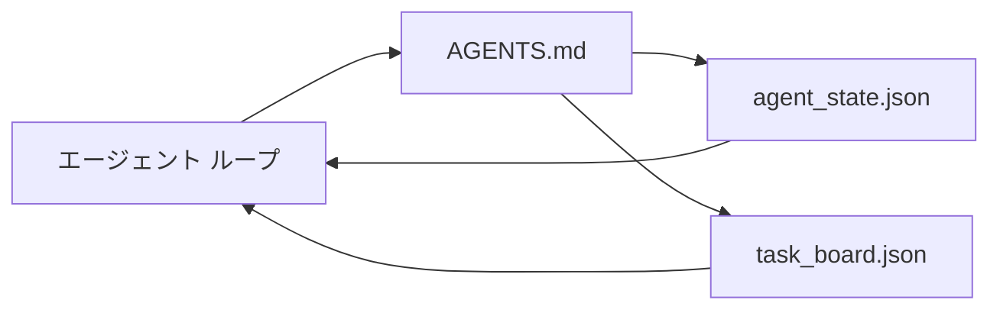

# 最小エージェント ワークベンチ

> 最小の有用なワークベンチは 3 つのファイルです: ルート命令ルーター、状態ファイル、タスク ボード。それ以外はすべて上の層です。リポジトリがこれら 3 つを負担できない場合、モデルはそれを保存しません。

**タイプ:** Build
**言語:** Python (stdlib)
**前提条件:** Phase 14 · 31 (Why Capable Models Still Fail)
**所要時間:** 約 45 分

## 学習目標

- 最小実行可能ワークベンチを構成する 3 つのファイルを定義できる。
- 短いルート ルーターが長い単一の `AGENTS.md` を打つ理由を説明できる。
- エージェント がすべてのターンで読んで終了時に書き込むことができる状態ファイルを構築できる。
- チャット履歴なしでマルチセッション作業を生き残るタスク ボードを構築できる。

## 問題

ほとんどのチームは 3000 行の `AGENTS.md` を書いてそれを完了と呼ぶことでワークベンチに到達します。 モデルはそれを読み込み、要約できない部分を無視し、常に失敗する同じ表面で失敗します。

あなたは反対が必要です。 関連する場合のみ、エージェントを深いファイルにルーティングするタイニー ルート ファイル。 行動する前にエージェントが読み、後で書き込む耐久状態。 何が飛んでいるか、何がブロックされているか、次に何があるかを言うタスク ボード。

3 つのファイル。 それぞれ 1 つの仕事。 それぞれマシン読み込み可能で、後で本当のシステムに進化できるほど。

## コンセプト



### AGENTS.md はマニュアルではなくルーターです

良い `AGENTS.md` は短いです。 それはエージェント を指します:

- 状態ファイル (あなたがいる場所)。
- タスク ボード (残されたもの)。
- より深いルール (`docs/agent-rules.md` 下)。
- 検証コマンド (それが機能することを知る方法)。

それ以上のもの はより深いドキュメントに入り、必要な場合のみ読み込まれます。 長いマニュアル は無視されます。 短いルーター は従われます。

### agent_state.json は記録のシステムです

状態は: アクティブなタスク ID、触れたファイル、作られた仮定、ブロッカー、次のアクション。 エージェント はそれをすべてのターンで読みます。 次のセッション はチャット をリプレイする代わりにそれを読みます。

状態ファイルに存在します。なぜなら、チャット履歴は信頼できないからです。 セッション は死にます。 会話はトリミング されます。 ファイル はそうではありません。

### task_board.json はキューです

タスク ボード はすべてのタスク ステータス `todo | in_progress | done | blocked` を負担します。 状態が空の場合にエージェント が から引く キュー、およびエージェント が軌道に乗っているかどうかを知りたい場合に読むキューです。

ボード上のタスク は ID、目標、所有者 (`builder`、`reviewer`、または `human`)、受け入れ基準を持っています。 ボード は意図的に小さい: 画面を超えて成長する場合、計画の問題があり、ボード 問題ではありません。

### 3 つのファイル は床、天井ではありません

後の レッスンはスコープ 契約、フィードバック ランナー、検証ゲート、レビューアー チェックリスト、ハンドオフ パケットを追加します。 ここの 3 つのファイル はそれらすべてが想定するものです。

## Build It

`code/main.py` は空のリポジトリに最小ワークベンチを書き込み、単一のエージェント ターンを示します:

1. `agent_state.json` を読む。
2. 状態が空の場合、`task_board.json` から次のタスクを引き出す。
3. スコープ内の単一ファイルに触れる。
4. 更新された状態を書き直す。

実行:

```
python3 code/main.py
```

スクリプト はそれ自体の隣に `workdir/` を作成し、3 つのファイルを配置し、1 ターンを実行し、差分を出力します。 再実行して、2 番目のターン が最初が停止した場所から拾うことを確認。

## Use It

本番環境エージェント 製品の内部では、同じ 3 つのファイル は異なる名前で表示されます:

- **Claude Code:** ルーター用の `AGENTS.md` または `CLAUDE.md`、状態用の `.claude/state.json` スタイル ストア、ボード用のフック。
- **Codex / Cursor:** ルーター用のワークスペース ルール、状態用のセッション メモリ、チャット サイドバーのキュー タスク(ボード用)。
- **カスタム Python エージェント:** あなたが書いた同じファイル。

名前が変更されます。 形は しません。

## 本番環境パターンが野生にあります

最小ワークベンチは、3 つのパターンが上に層化されるとき、実際のモノレポ との接触を生き残ります。 それらは独立; リポジトリが実際に必要なもの を選択。

**ネストされた `AGENTS.md` と最寄り勝利の優先順位。** OpenAI はメイン リポジトリ全体で 88 つの `AGENTS.md` ファイルを出荷、サブコンポーネント ごと 1 つ。 Codex、Cursor、Claude Code、Copilot はすべてワーキング ファイルからリポジトリ ルート に向かって歩き、途中で見つかるすべての `AGENTS.md` を連結します。 サブディレクトリ ファイル はルート ファイル を拡張。 Codex は置換に `AGENTS.override.md` を追加; オーバーライド メカニズム は Codex 固有で、クロスツール 作業に対して回避。 Augment Code の測定 はアクセス: 最良の `AGENTS.md` ファイル は Haiku から Opus へのアップグレード に相当する品質ジャンプを提供; 最悪のもの はファイルなし より出力を悪化させます。

**それが カバレッジのように見える場合でも、拒否する anti-パターン。** 矛盾する指示はエージェント をサイレント イ対話型からグリーディ モード にドロップ (ICLR 2026 AMBIG-SWE: 48.8% → 28% 解決率); フラット にスタック する代わり に番号の優先順位。 検証不可能なスタイル ルール 「Google Python Style Guide に従う」) 強制コマンドなしで、エージェント にコンプライアンスを発明させる; すべてのスタイル ルール を正確な lint コマンド と共にペア。 スタイル でリード 検証パス を埋める; コマンド 最初、スタイル 最後。 人間のために書く エージェント の代わりに コンテキスト 予算を浪費; 簡潔さ は機能です。

**クロスツール シンボリック リンク。** 単一ルート ファイル (シンボリック リンク付き) (`ln -s AGENTS.md CLAUDE.md`、`ln -s AGENTS.md .github/copilot-instructions.md`、`ln -s AGENTS.md .cursorrules`) すべてのコーディング エージェント を同じ真実の供給元に保ちます。 Nx の `nx ai-setup` は単一設定 からClaude Code、Cursor、Copilot、Gemini、Codex、OpenCode 全体でこれを自動化します。

## Ship It

`outputs/skill-minimal-workbench.md` は任意の新しいリポジトリ用の 3 ファイル ワークベンチを生成: プロジェクトに合わせた `AGENTS.md` ルーター、正しいキー を持つ `agent_state.json`、現在のバックログ でシード された `task_board.json`。

## 演習

1. `last_run` タイムスタンプを `agent_state.json` に追加。 オペレーター が確認しない限り、ファイル が 24 時間より古い場合は実行を拒否。
2. タスク ボード に `priority` フィールド を追加し、puller を常に最高優先度 `todo` を選択するように変更。
3. `task_board.json` を JSON Lines に移行して各タスク が1行で、diffs がバージョン制御でクリーン。
4. `lint_workbench.py` を記述して、`AGENTS.md` が 80 行を超える場合、または存在しないファイル を参照する場合に失敗。
5. 3 つのファイル のうち、失うと最も痛むであろう 1 つを決定。 それを弁護。

## 主要用語

| 用語 | 人々が言うこと | 実際の意味 |
|------|----------------|----------|
| ルーター | `AGENTS.md` | エージェント を深いドキュメント とファイル に指す短いルート ファイル |
| 状態ファイル | 「メモ」 | エージェント がいるかについての マシン読み込み可能なレコード、すべてのターン で書き込む |
| タスク ボード | 「バックログ」 | ステータス、所有者、受け入れ を持つ JSON キュー作業 |
| 記録のシステム | 「真実の供給元」 | チャット がなくなったときにワークベンチ が権威と扱うファイル |

## 参考文献

- [agents.md — the open spec](https://agents.md/) — Cursor、Codex、Claude Code、Copilot、Gemini、OpenCode で採用
- [Augment Code, A good AGENTS.md is a model upgrade. A bad one is worse than no docs at all](https://www.augmentcode.com/blog/how-to-write-good-agents-dot-md-files) — 測定された品質ジャンプ
- [Blake Crosley, AGENTS.md Patterns: What Actually Changes Agent Behavior](https://blakecrosley.com/blog/agents-md-patterns) — 実験的に機能するもの、しないもの
- [Datadog Frontend, Steering AI Agents in Monorepos with AGENTS.md](https://dev.to/datadog-frontend-dev/steering-ai-agents-in-monorepos-with-agentsmd-13g0) — ネストされた優先順位(実装)
- [Nx Blog, Teach Your AI Agent How to Work in a Monorepo](https://nx.dev/blog/nx-ai-agent-skills) — 6 つのツール全体での単一ソース生成
- [The Prompt Shelf, AGENTS.md Best Practices: Structure, Scope, and Real Examples](https://thepromptshelf.dev/blog/agents-md-best-practices/) — レビュー を生き残るセクション 順序
- [Anthropic, Claude Code subagents and session store](https://docs.anthropic.com/en/docs/agents-and-tools/claude-code/sub-agents)
- Phase 14 · 31 — このミニマム が吸収する障害モード
- Phase 14 · 34 — このレッスン が見越する耐久状態スキーマ
