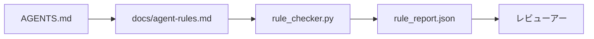

# エージェント命令を実行可能な制約として

> 散文として書かれた指示は願いです。 制約として書かれた指示はテストです。 ワークベンチ は各ルール をエージェント がランタイムで確認できるもの、およびレビューアー が事後に確認できるもの に変えます。

**タイプ:** Build
**言語:** Python (stdlib)
**前提条件:** Phase 14 · 32 (Minimal Workbench)
**所要時間:** 約 50 分

## 学習目標

- ルーティング散文を運用ルール から分離できる。
- スタートアップ ルール、禁止されたアクション、完了の定義、不確実性処理、承認境界 をマシンチェック可能な制約として表現できる。
- 実行をルール セット に対してスコアするルール チェッカーを実装できる。
- ルール セット をdiff フレンドリー にして、レビュー が変更を見ることができるようにできる。

## 問題

典型的な `AGENTS.md` はオンボーディング ドキュメントのように読みます。 それはエージェント に「注意する」、「徹底的にテストする」、「不確かな場合は尋ねる」と伝えます。 3 日後、エージェント はテストなしで変更をシップし、禁止されたディレクトリ に書き込み、線がどこにあるかわからなかったため、尋ねることはありません。

指示はそれらが運用的であるときは強力で、それらが抱負的であるときは弱いです。 修正は、ワークベンチ が解釈でき、レビューアー が スコアできるルール を書くことです。

## コンセプト

ルール は `docs/agent-rules.md` に属し、短いルート ルーターから離れています。 各ルール は名前、カテゴリ、チェック を持っています。



### ほとんどのルール をカバーする 5 つのカテゴリー

| カテゴリー | ルール が答える質問 | 例 |
|----------|---------------------------|---------|
| スタートアップ | 作業開始前に何が真である必要があるか? | 「状態ファイル は存在し、新鮮です」 |
| 禁止 | 何が決して起こらないべきか? | 「`scripts/release.sh` を編集しないでください」 |
| 完了の定義 | タスク が完了したことを何が証明するか? | 「pytest はエクスポート 0 で、受け入れ行は成功」 |
| 不確実性 | エージェント が不確かなとき何をするか? | 「推測する代わりに質問ノート を開く」 |
| 承認 | 何が人間の承認を必要とするか? | 「任意の新しい依存関係、任意の本番環境 書き込み」 |

これら 5 つのうち 1 つに適合しないルール は通常、 2 つのルール になりたいです。 分割を強制 。

### ルール はマシン読み込み可能です

各ルール はスラッグ、カテゴリ、1 行の説明、および `rule_checker.py` の関数に名前を付ける `check` フィールド を持っています。 ルール を追加することはチェック を追加することを意味; チェッカー はワークベンチ とともに成長。

### ルール は diff フレンドリーです

ルール は単一 markdown ファイルの見出しごと 1 つ存在。 名前変更は diffs で見られます。 新しいルール はそれぞれのカテゴリー の上に置かれます。 古いルール はコメント アウトされず、削除されます。ワークベンチ は会話ログではなく、真実の供給源だからです。

### ルール 対フレームワーク ガードレール

フレームワーク ガードレール (OpenAI Agents SDK ガードレール、LangGraph 割り込み) はランタイム レベル でルール を強制。 このレッスンの ルール セット はそれらのガードレール が実装する人間読める、レビュー可能な契約です。 両方が必要: ランタイム はターン 中に違反 をキャッチ、ルール セット はランタイム が正しいことをしていることを証明。

## Build It

`code/main.py` は出荷:

- `agent-rules.md` パーサーがルール をデータクラス に読み込む。
- `rule_checker.py` スタイル チェッカー 関数、`check` リファレンスごと 1 つ。
- 2 つのルール を違反し、チェック パス がそれらをキャッチする デモ エージェント 実行。

実行:

```
python3 code/main.py
```

出力: 解析されたルール セット、トレース を実行、ルール ごとの成功/失敗、およびスクリプト の隣に保存される `rule_report.json`。

## 本番環境パターンが野生にあります

3 つのパターン は四半期 持続するルール セット を 1 週間で減衰するもの から分離。

**書き込み時の重大度 タグ付け。** すべてのルール は `severity` を運ぶ: `block`、`warn`、または `info`。 チェッカー はすべて 3 つをレポート; ランタイム は `block` のみで拒否。 ほとんどのチーム は早期に重大度を過剰に述べ、その後、期限圧力下で静かに弱める; 書き込み時にタグ付けは前面での校正を強制。 検証ゲート (Phase 14 · 38) とペア、`block` ルール の任意のオーバーライド を `overrides.jsonl` 監査ログに署名します。

**ルール 有効期限を強制関数として。** すべてのルール は `expires_at` 日付を運ぶ (デフォルト 作成から 90 日)。 チェッカー は警告を出力します, 期限切れでない ルール が 60 連続日 違反なし があるとき; 次の四半期 レビュー はそれを保つ正当化、`info` に弱める、またはそれを削除します。 Cloudflare の本番環境 AI Code Review データ (2026 年 4 月、30 日 間 5,169 リポジトリ 全体で 131,246 レビュー 実行) は、明示的な有効期限を持つ ルール セット がリポジトリ ごと 30 ルール 以下に留まった; なし セット は 80+ に成長し、ほとんど発火しません。

**Markdown としてのソース、JSON としてのキャッシュ。** `agent-rules.md` は作成ファイル; `agent-rules.lock.json` はチェッカー がホット パス で読むキャッシュ。 ロック は pre-commit フック で再生成。 Markdown diffs はレビュー可能; JSON 解析 はすべてのターン から出ます。 `package.json` / `package-lock.json` と `Cargo.toml` / `Cargo.lock` と同じ形。

## Use It

本番環境:

- Claude Code、Codex、Cursor はセッション 開始時 ルール を読み、アクション を拒否する場合 引用。 チェッカー はそれらを CI で再実行してサイレント ドリフト をキャッチ。
- OpenAI Agents SDK ガードレール は同じ チェック を入力およ出力 ガードレール として登録。 Markdown はドキュメント サーフェス; SDK はランタイム サーフェス。
- LangGraph 割り込み はフライ中のノード がルール を違反するときに発火。 割り込み ハンドラー はルール を読み、人間 に尋ね、再開。

ルール セット はすべて 3 つ全体で ポータブルです。それはマークダウン + 関数名のみだからです。

## Ship It

`outputs/skill-rule-set-builder.md` はプロジェクト所有者 にインタビュー、既存の散文 指示 を 5 つのカテゴリーに分類、バージョン化された `agent-rules.md` + チェッカー スタブ を出力します。

## 演習

1. あなたの製品が真に必要な場合、6 番目のカテゴリー を追加。 それが 5 つのうち 1 つに崩壊しない理由を弁護。
2. チェッカー を拡張したら、ルール は重大度 (`block`、`warn`、`info`) を運び、レポート それに応じて集計。
3. チェッカー を CI にワイア: 最新のエージェント 実行時に block 重大度 ルール が失敗するとビルド を失敗。
4. ルール ごと に「有効期限」フィールド を追加。 チェック 失敗なし 90 日後、ルール はレビュー 対象。
5. 本当の `AGENTS.md` を見つけ、5 カテゴリー ルール として書き直す。 その行の何がが運用的でしたか? 何がが抱負的でしたか?

## 主要用語

| 用語 | 人々が言うこと | 実際の意味 |
|------|----------------|----------|
| 運用ルール | 「本当の指示」 | ワークベンチ がランタイム でチェック できるルール |
| 抱負的ルール | 「注意する」 | チェック なしのルール; 削除 またはアップグレード |
| 完了の定義 | 「受け入れ」 | タスク が完了したことをの客観的、ファイル 支援証明 |
| Block 重大度 | 「ハード ルール」 | 違反 はラン をハルト; オペレーター なしで沈黙させることはできない |
| ルール 有効期限 | 「古いルール スイープ」 | N 日 でチェック 失敗なし のルール は廃止対象 |

## 参考文献

- [OpenAI Agents SDK guardrails](https://platform.openai.com/docs/guides/agents-sdk/guardrails)
- [LangGraph interrupts](https://langchain-ai.github.io/langgraph/how-tos/human_in_the_loop/breakpoints/)
- [Anthropic, Building Effective Agents](https://www.anthropic.com/research/building-effective-agents)
- [Rick Hightower, Agent RuleZ: A Deterministic Policy Engine](https://medium.com/@richardhightower/agent-rulez-a-deterministic-policy-engine-for-ai-coding-agents-9489e0561edf) — 本番環境での block/warn/info 重大度
- [Cloudflare, Orchestrating AI Code Review at Scale](https://blog.cloudflare.com/ai-code-review/) — 131k レビュー 実行、ルール 構成 レッスン
- [microservices.io, GenAI development platform — part 1: guardrails](https://microservices.io/post/architecture/2026/03/09/genai-development-platform-part-1-development-guardrails.html) — ルール と CI の間の深さ防御
- [Type-Checked Compliance: Deterministic Guardrails (arXiv 2604.01483)](https://arxiv.org/pdf/2604.01483) — ルール・アズ・チェック の上限としての Lean 4
- [logi-cmd/agent-guardrails](https://github.com/logi-cmd/agent-guardrails) — マージ ゲート 実装: スコープ、ミューテーション テスト、違反 予算
- Phase 14 · 32 — このルール セット が落ちる最小 ワークベンチ
- Phase 14 · 38 — ルール レポート を消費する検証 ゲート
- Phase 14 · 39 — ルール コンプライアンス をスコア する レビューアー エージェント
