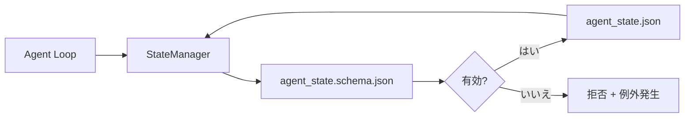

# リポジトリメモリと永続的な状態

> チャット履歴は揮発性である。リポジトリは永続的である。ワークベンチはエージェント状態をバージョン管理されたファイルに保存し、次のセッション、次のエージェント、次のレビュアーが同じ情報源から読む。

**タイプ:** ビルド
**言語:** Python (stdlib + `jsonschema` オプション)
**前提条件:** Phase 14 · 32 (最小ワークベンチ)
**所要時間:** 約60分

## 学習目標

- リポジトリメモリに属するもの、チャット履歴に属するものを定義する。
- `agent_state.json`と`task_board.json`のJSONスキーマを作成する。
- 状態をロード、検証、変更、原子的に永続化する状態マネージャを構築する。
- スキーマを使用して悪い書き込みを拒否し、ワークベンチの破損を防ぐ。

## 問題

エージェントはセッションを終了する。チャットは閉じられる。次のセッションが開き、どこから始めるのか尋ねる。モデルは「ファイルをチェックさせてください」と言い、古いメモを読み、すでに完了した作業をやり直す。あるいはさらに悪いことに、誰も完了したファイルがあることを教えてくれなかったので、完成したファイルを上書きしてしまう。

ワークベンチの解決策はリポジトリメモリである。状態はリポジトリ内のJSONファイルに存在し、スキーマの下で書かれ、原子的に永続化され、コードレビューで差分として見える。チャットは一時的なフィードであり、リポジトリは記録の真実である。

## コンセプト



### リポジトリメモリに属するもの

| 属する | 属さない |
|---------|-----------------|
| アクティブなタスクID | 生のチャット文字起こし |
| このセッションで変更されたファイル | トークンレベルの推論トレース |
| エージェントが行った仮定 | 「ユーザーが不満そうだった」 |
| オープンなブロッカー | サンプリングされた補完結果 |
| 次のアクション | ベンダー固有のモデルID |

テストは耐久性である。これは3ヶ月後にCI再実行で役に立つか？そうであればリポジトリ。そうでなければテレメトリ。

### スキーマファーストの状態

JSONスキーマは契約である。それがなければ、すべてのエージェントが新しいフィールドを作成し、すべてのレビュアーが新しい形式を学び、すべてのCIスクリプトが過去のバージョンを特殊ケース処理する必要がある。それがあれば、悪い書き込みは拒否される書き込みである。

スキーマは以下をカバーする：

- 必須キー。
- 許可された`status`値。
- 禁止された値（例えば配列の場合の`null`）。
- パターン制約（タスクIDは`T-\d{3,}`にマッチ）。
- マイグレーション用のバージョンフィールド。

### 原子的な書き込み

状態の書き込みは部分的な失敗から生き残る必要がある。一時ファイルに書き込み、fsync、ターゲットの上に名前を変更する。状態ファイルは情報源であり、半分書き込まれたファイルはまったくないファイルより悪い。

### マイグレーション

スキーマが変更されたら、スキーマバンプの隣に移行スクリプトを配布する。状態ファイルは`schema_version`フィールドを持ち、マネージャーが移行できないバージョンのファイルをロードすることを拒否する。

## ビルドする

`code/main.py`は以下を実装する：

- `agent_state.schema.json`と`task_board.schema.json`。
- stdlib のみのバリデータ（JSONスキーマのサブセット：required、type、enum、pattern、items）。
- 原子的な一時ファイルと名前変更の書き込みを伴う`StateManager.load`、`StateManager.update`、`StateManager.commit`。
- 状態を変更し、永続化し、リロードし、ラウンドトリップを証明するデモ。

実行する：

```
python3 code/main.py
```

スクリプトは`workdir/agent_state.json`と`workdir/task_board.json`を書き込み、2ターンにわたってそれらを変更し、各ステップで検証された状態を出力する。

## 本番環境のパターン

4つのパターンがこのレッスンの最小値をマルチエージェントモノレポが生き残れるものに変える。

**原子的な一時ファイルと名前変更は必須である。** 2026年3月のHiveプロジェクトバグレポートは失敗モードを明確に文書化している。`state.json`は`write_text()`で書き込まれ、例外は捕捉されて沈黙させられた。部分的な書き込みはセッションが信号なしで破損した状態に対して再開するままにした。修正は常に以下の通りである：ターゲットと同じディレクトリ内の`tempfile.mkstemp`、書き込み、`fsync`、`os.replace`（POSIXとWindows上の原子的な名前変更）。このレッスンの`atomic_write`はまさにそれを行う。

**すべての非べき等なツール呼び出しに対するべき等性キー。** エージェントがツール呼び出しの後だが結果のチェックポイント前にクラッシュした場合、リカバリーはツール呼び出しを再試行する。読み取りの場合は安全。メール、DBの挿入、ファイルアップロードの場合は危険。パターンは以下の通り：実行前にペンディング呼び出いID を`pending_calls.jsonl`に記録する。再試行時に、IDがあるかをチェック。存在しれば、呼び出しをスキップしてキャッシュされた結果を使用する。AnthropicとLangChainの両方が2026年のガイダンスでこれを指摘する。LangGraphのチェックポインターは同じ理由でペンディング書き込みを永続化する。

**大きなアーティファクトを状態から分離する。** CSV、長い文字起こし、生成されたファイルを`agent_state.json`に保存しないでください。アーティファクトを別のファイル（またはオブジェクトストレージにアップロード）として保存し、状態にはパスだけを保持する。チェックポイントは小さく高速のままである。アーティファクトは独立して成長する。

**監査のためのイベントソーシング、再開のためのスナップショット。** すべての変更時に`state.events.jsonl`イベントログに追記。定期的に`state.json`にスナップショット。再開はスナップショットを読み、スナップショットのタイムスタンプ後のイベントをすべて再生する。これはより多くのディスクコストを費やすが、エージェント決定を逐語的に再生させる。長期的な実行をデバッグするときに不可欠である。Postgres が WALに対して内部的に使用する同じ形状。

**スキーママイグレーションまたはロード拒否。** `schema_version`整数は契約である。マネージャーが未知のバージョンのファイルをロードするとき、読み取りを拒否する。スキーマバンプの隣に移行スクリプトを配布。`tools/migrate_state.py`はすべての起動時にべき等に実行される。

## 使用する

本番環境では：

- **LangGraph チェックポインター。** 同じアイデア、異なるストレージ。チェックポインターはグラフ状態をSQLite、Postgres、またはカスタムバックエンドに永続化する。このレッスンが教えるスキーマはチェックポインターが死んで手動で状態を読む必要があるときに到達するものである。
- **Letta メモリブロック。** 構造化スキーマを持つ永続ブロック（Phase 14 · 08）。長期実行ペルソナにスコープされた同じ規律。
- **OpenAI Agents SDK セッションストア。** プラッグ可能なバックエンド、スキーマ対応。このレッスンの状態ファイルはローカルファイルバックエンドである。

## 配布する

`outputs/skill-state-schema.md`はプロジェクト固有のJSONスキーマペア（状態+ボード）、原子的な書き込みに配線されたPython`StateManager`、次のスキーマバンプがワークベンチを破損しないようにするためのマイグレーションスキャフォルディングを生成する。

## 演習

1. `last_human_touch`タイムスタンプを追加する。人間の編集後5秒以内のエージェント書き込みを拒否する。
2. バリデータを拡張して`oneOf`をサポートする。タスクはビルドタスクまたは異なる必須フィールドを持つレビュータスクのいずれかである。
3. `schema_version`フィールドを追加し、v1からv2への移行を書く（`blockers`を`risks`に名前変更）。
4. ストレージバックエンドをローカルファイルからSQLiteに移動する。`StateManager`APIは同じままである。
5. 同じ状態ファイルに対して2つのエージェントを50msの書き込みレースで実行する。何が悪くなり、原子的な名前変更はどのようにあなたを救うか？

## キーターム

| ターム | 人々が言うこと | 実際の意味 |
|------|----------------|------------------------|
| リポジトリメモリ | 「メモファイル」 | スキーマの下でリポジトリ内の追跡されたファイルに保存された状態 |
| スキーマファースト | 「入力を検証する」 | ライターの前に契約を定義し、ドリフトを拒否する |
| 原子的な書き込み | 「ただ名前を変更する」 | 一時ファイルに書き込み、fsync、名前変更して、部分的な失敗が破損できないようにする |
| マイグレーション | 「スキーマバンプ」 | vNの状態をv(N+1)の状態に変える スクリプト |
| 記録の真実 | 「情報源」 | ワークベンチが権威あるものとして扱うアーティファクト |

## 参考文献

- [JSON Schema specification](https://json-schema.org/specification.html)
- [LangGraph checkpointers](https://langchain-ai.github.io/langgraph/concepts/persistence/)
- [Letta memory blocks](https://docs.letta.com/concepts/memory)
- [Fast.io, AI Agent State Checkpointing: A Practical Guide](https://fast.io/resources/ai-agent-state-checkpointing/) — スキーマファーストのチェックポイント、べき等性
- [Fast.io, AI Agent Workflow State Persistence: Best Practices 2026](https://fast.io/resources/ai-agent-workflow-state-persistence/) — 同時実行制御、TTL、イベントソーシング
- [Hive Issue #6263 — 非原子的なstate.json書き込みが無視される](https://github.com/aden-hive/hive/issues/6263) — 実際のプロジェクトの失敗モード
- [eunomia, Checkpoint/Restore Systems: Evolution, Techniques, Applications](https://eunomia.dev/blog/2025/05/11/checkpointrestore-systems-evolution-techniques-and-applications-in-ai-agents/) — OSの歴史からエージェントに適用されたCRプリミティブ
- [Indium, 7 State Persistence Strategies for Long-Running AI Agents in 2026](https://www.indium.tech/blog/7-state-persistence-strategies-ai-agents-2026/)
- [Microsoft Agent Framework, Compaction](https://learn.microsoft.com/en-us/agent-framework/agents/conversations/compaction) — ベンダーチェックポイントマネージャー
- Phase 14 · 08 — メモリブロックとスリープ時間の計算
- Phase 14 · 32 — このレッスンがスキーマ化する3ファイル最小
- Phase 14 · 40 — 同じスキーマから読むハンドオフパケット
