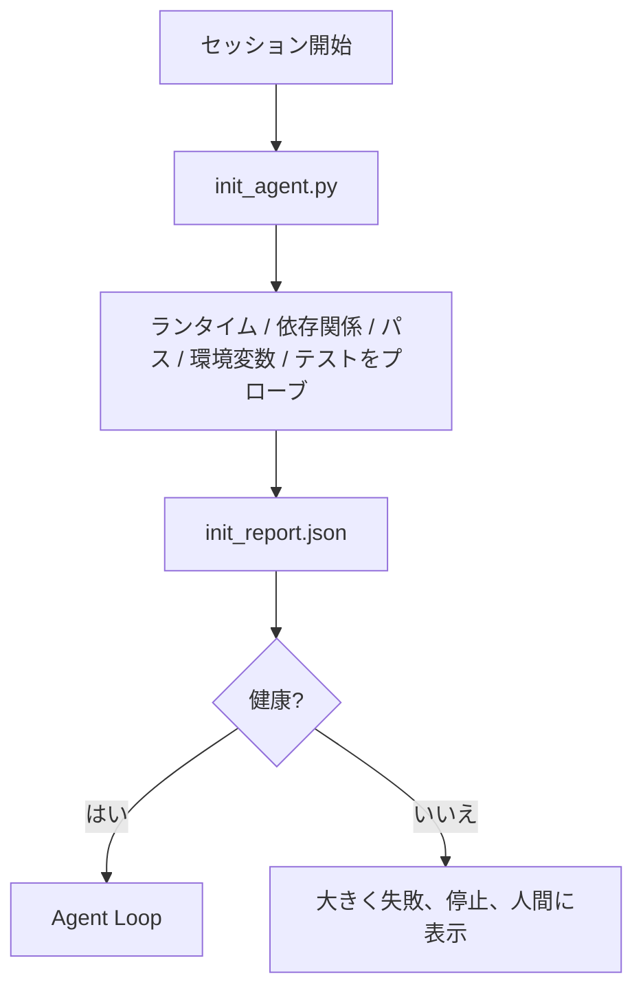

# エージェント用の初期化スクリプト

> コールドスタートするすべてのセッションが税金を払う。エージェントは同じファイルを読み、同じプローブを再試行し、同じパスを再発見する。初期化スクリプトは税金を一度払い、答えを状態に書き込む。

**タイプ:** ビルド
**言語:** Python (stdlib)
**前提条件:** Phase 14 · 32 (最小ワークベンチ)、Phase 14 · 34 (リポジトリメモリ)
**所要時間:** 約45分

## 学習目標

- エージェントがセッションごとにやり直すべきでない作業を特定する。
- ランタイム、依存関係、リポジトリヘルスをプローブする決定論的な初期化スクリプトを構築する。
- プローブ結果を永続化して、エージェントが代わりにそれを読むようにする。
- 初期化に失敗したときに大きく、速く、1つの場所を見て失敗する。

## 問題

セッションを開く。エージェントはPythonバージョンを推測する。テストコマンドを推測する。リポジトリルート5回リストして、エントリポイントを見つける。インストールされていないパッケージをインポートしようとする。ユーザーにコンフィグファイルがどこにあるか尋ねる。実際の編集を行う時までに、単一のスクリプトであるべき設定作業に10,000トークンが費やされている。

修正は、エージェントが何をする前に実行し、エージェントが起動時に読む`init_report.json`を書き込む、1つの初期化スクリプトである。

## コンセプト



### 初期化スクリプトがプローブするもの

| プローブ | 重要な理由 |
|-------|----------------|
| ランタイムバージョン | 間違ったPythonまたはNodeバージョンは無声な間違ったバージョンのバグを意味する |
| 依存関係の入手可能性 | 不足しているパッケージは後で捕捉するのに10倍の費用がかかる |
| テストコマンド | エージェントは検証方法を知る必要があり、コマンドがないとワークベンチは壊れている |
| リポジトリパス | ハードコードされたパスは漂う。1回解決して固定する |
| 環境変数 | 不足している`OPENAI_API_KEY`は失敗の表面であり、ランタイムミステリーではない |
| 状態+ボードの鮮度 | クラッシュしたセッションからの古い状態は足銃である |
| 最後に既知の良いコミット | セッション終了時のハンドオフ差分のアンカー |

### 大きく、速く、1つの場所で失敗する

プローブ失敗は停止を意味し、人間に表示する。「エージェントが理解するだろう」はない。初期化全体の要点は、ワークベンチが壊れているときに起動を拒否することである。

### べき等

2回連続で実行する。2回目の実行は新しいタイムスタンプ以外はノーオペレーションであるべき。べき等性はスクリプトをCI、フック、またはタスク前スラッシュコマンドに接続できるようにしている。

### 初期化対スタートアップルール

ルール（Phase 14 · 33）は何が行動するために真である必要があるかを説明する。初期化はそれらのルールがチェックできるように設立するスクリプトである。初期化なしのルールは「注意する」になる。ルール なしの初期化は洗練された失敗になる。

## ビルドする

`code/main.py`は`init_agent.py`を実装する：

- 5つのプローブ：Python バージョン、`importlib.util.find_spec`経由のリストされた依存関係、テストコマンド解決可能性、必須環境変数、状態ファイルの鮮度。
- 各プローブは`(name, status, detail)`を返す。
- スクリプトはフルプローブセットで`init_report.json`を書き込み、ブロック重大度のプローブが失敗した場合は非ゼロで終了する。

実行する：

```
python3 code/main.py
```

スクリプトはプローブのテーブルを出力し、`init_report.json`を書き込み、正常なパス上でゼロで終了するか、失敗したプローブのリストで非ゼロで終了する。

## 本番環境のパターン

3つのパターンが有用な初期化スクリプトを儀式から分ける。

**最後に既知の良いコミットのアンカリング。** 最後の成功したマージで書き込まれた`LKG`ファイルに対して現在のコミットをプローブする。差分が予算を超える場合（デフォルト50ファイル）、起動を拒否し、新しいベースラインを承認する人間が必要。これはCloudflareのAI Code Reviewがレビュアーエージェントをスコープするために使用するもの。すべてのレビューセッションは同じ最後に既知の良いものに対してアンカーし、セッション全体でドリフトを複合させない。

**TTLを持つロックファイル。** 最初の成功したプローブパスの後に`prereqs.lock`を書き込む。後続の実行はN時間（デフォルト24h）ロックを信頼し、高価なプローブをスキップする。初期化スクリプトはまずロックを読む。新しく、依存関係マニフェストハッシュが一致する場合、短絡する。これはDockerがレイヤーキャッシュに使用するのと同じパターンである：べき等なプローブ+コンテンツハッシュ=スキップ。

**ホットパス内に許可なし、LLMなし、サプライズなし。** 初期化プローブは決定論的な配管である。LLMを呼び出して失敗を分類するプローブ、または外部サービスを打ってライセンスをチェックするプローブはプローブではない。それはワークフローである。プローブがドライラン中に3秒以上かかる場合、それをワークベンチの臭いとして扱い、初期化の外に移動するか、その結果をキャッシュする。

## 使用する

本番環境では：

- **Claude Code フック。** `pre-task`フックが初期化スクリプトを呼び出し、失敗した場合、エージェント起動を拒否する。
- **GitHub Actions。** `setup-agent`ジョブが初期化スクリプトを実行。エージェントジョブはそれに依存する。
- **Docker エントリポイント。** エージェントコンテナはエージェントランタイムを実行する前に初期化スクリプトを実行。ログが失敗時に表示される。

初期化スクリプトは特定のフレームワークへの呼び出しを行わないため、ポータブルである。Bash、Make、またはタスクファイルはすべてそれをラップできる。

## 配布する

`outputs/skill-init-script.md`はプロジェクトにインタビューし、セットアップ作業をプローブに分類し、プロジェクト固有の`init_agent.py`とエージェントステップの前にそれを実行するCIワークフローを出力する。

## 演習

1. 現在のコミットを最後に既知の良いコミットに対して差分し、50以上のファイルが変更された場合に起動を拒否するプローブを追加する。
2. `prereqs.lock`ファイルを書き込み、ロックが7日以上古い場合に起動を拒否するようにスクリプトを配線する。
3. 不足している開発依存関係を自動インストールするが、承認なしにランタイム依存関係を決して変更しない`--fix`フラグを追加する。
4. プローブをハードコードされた関数からYAMLレジストリに移動する。トレードオフを擁護する。
5. プローブごとのタイミング予算を追加する。3秒以上実行するプローブはワークベンチの臭いである。

## キーターム

| ターム | 人々が言うこと | 実際の意味 |
|------|----------------|------------------------|
| プローブ | 「チェック」 | `(name, status, detail)`を返す決定論的な関数 |
| 初期化レポート | 「セットアップ出力」 | プローブ結果で状態の隣に書き込まれたJSON |
| べき等 | 「安全に再実行する」 | 2回連続の実行はタイムスタンプを法として同一のレポートを生成 |
| 大きく失敗 | 「呑み込まない」 | 停止して人間に表示。無声のフォールバックなし |
| セットアップ税 | 「ブートストラップコスト」 | エージェントがセッションごとに明白なものを再発見するために費やすトークン |

## 参考文献

- [Anthropic, Effective harnesses for long-running agents](https://www.anthropic.com/engineering/effective-harnesses-for-long-running-agents)
- [GitHub Actions, composite actions for setup](https://docs.github.com/en/actions/sharing-automations/creating-actions/creating-a-composite-action)
- [microservices.io, GenAI dev platform: guardrails](https://microservices.io/post/architecture/2026/03/09/genai-development-platform-part-1-development-guardrails.html) — 初期化としてのコミット前+CIチェック
- [Augment Code, How to Build Your AGENTS.md (2026)](https://www.augmentcode.com/guides/how-to-build-agents-md) — 初期化の期待
- [Codex Blog, Codex CLI Context Compaction](https://codex.danielvaughan.com/2026/03/31/codex-cli-context-compaction-architecture/) — 圧縮認識初期化としてのセッション開始
- Phase 14 · 33 — このスクリプトが有効にするルールセット
- Phase 14 · 34 — このスクリプトがシード する状態ファイル
- Phase 14 · 38 — このスクリプトがフィードする検証ゲート
- Phase 14 · 40 — 初期化レポートの最後に既知の良いを消費するハンドオフ
