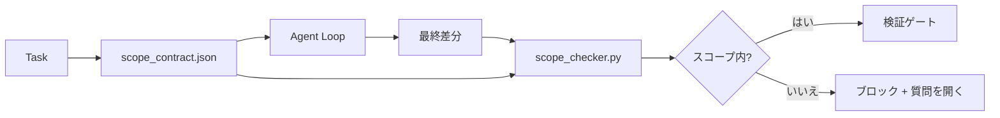

# スコープ契約とタスク境界

> モデルは作業がどこで終わるかを知らない。スコープ契約はタスクごとのファイルであり、作業がどこで始まり、どこで終わり、あふれた場合にロールバックする方法を言う。契約は「スコープ内に留まる」を願いからチェックに変える。

**タイプ:** ビルド
**言語:** Python (stdlib)
**前提条件:** Phase 14 · 32 (最小ワークベンチ)、Phase 14 · 33 (制約としてのルール)
**所要時間:** 約50分

## 学習目標

- エージェントがタスク開始時に読み、検証者がタスク終了時に読むスコープ契約を書く。
- 許可されたファイル、禁止されたファイル、受入れ基準、ロールバック計画、承認境界を指定する。
- 契約に対して差分を比較するスコープチェッカーを実装する。
- スコープクリープを可視化し、自動化し、レビュー可能にする。

## 問題

エージェントはクリープする。タスクは「ログインバグを修正する」である。差分はログインルート、メールヘルパー、データベースドライバ、README、リリーススクリプトに触れる。各タッチは瞬間に妥当な理由があった。一緒に、レビューされたものとは異なる変更である。

スコープクリープは、エージェントが各ステップを善意で説明するため、エージェント作業で最も監視されていない失敗モードである。修正はより厳しいプロンプトではない。修正は、何が約束されたか、結果が約束に対して比較されるチェックを言う、ディスク上の契約である。

## コンセプト



### スコープ契約に何が入るか

| フィールド | 目的 |
|-------|---------|
| `task_id` | ボード上のタスクにリンク |
| `goal` | レビュアーが検証できる1文 |
| `allowed_files` | エージェントが書き込むことができるグロブ |
| `forbidden_files` | エージェントが事故でもタッチしてはいけないグロブ |
| `acceptance_criteria` | 完了を証明するテストコマンドまたはアサーション行 |
| `rollback_plan` | オペレーターが停止に必要な場合に実行できる1段落 |
| `approvals_required` | スコープ外の操作が明示的な人間の署名を必要とする |

`forbidden_files`のない契約は不完全である。負のスペースは契約の半分である。

### 生のパス、グロブ

実際のリポジトリはファイルを移動する。グロブに契約をピン止めする（`app/**/*.py`、`tests/test_signup*.py`）して、セッション間のリファクタリング は契約を無効にしない。

### ロールバックはスコープの一部

ロールバック方法をリストすることは、契約著者に何が悪くなるか考えさせる。ロールバックできない契約は承認されるべきではない契約である。

### スコープチェックは差分チェック

エージェントは差分を書く。チェッカーは差分、許可されたグロブ、禁止されたグロブ、実行された受入れコマンドのリストを読む。各違反は検証ゲートが拒否できるタグ付き調査結果である。

## ビルドする

`code/main.py`は以下を実装する：

- `scope_contract.json`スキーマ（JSONスキーマのサブセット、グロブ配列）。
- 差分パーサーが、変更されたファイルのリストと実行されたコマンドのリストを`RunSummary`に変える。
- 契約に対して`(violations, in_scope, off_scope)`を返す`scope_check`。
- 2つのデモ実行：スコープ内に留まるもの、クリープするもの。チェッカーはクリープを正確なファイルと理由でフラグ。

実行する：

```
python3 code/main.py
```

出力：契約、2つの実行、実行ごとの評決、保存された`scope_report.json`。

## 本番環境のパターン

「specsmaxxing」（エージェント呼び出し前のYAMLのスコープ契約）を実行する実務家は、ウサギ穴レート を3週間で52%から21%に落としたと報告し、エージェントを変更しなかった。契約が仕事をした、モデルではなく。3つのパターンがゲイン を固定する。

**バイナリ失敗ではなく違反予算。** `agent-guardrails`（Claude Code、Cursor、Windsurf、Codex経由MCPで使用されるOSSマージゲート）はタスクごとの`violationBudget`を配布する。予算内の軽微なスコープスリップは警告として表示。予算を超えた場合のみマージゲートが拒否。`violationSeverity: "error" | "warning"`でペア。予算はゲートが配布するゲートとそれを嫌ったチームが無効にするゲートの違いである。

**パスファミリー全体での重大度の非対称性。** `docs/**`へのスコープ外の書き込みは通常`warn`。`scripts/**`、`migrations/**`、`config/prod/**`へのスコープ外の書き込みは常に`block`。この非対称性はランタイムではなく契約に住む必要があり、プロジェクト固有であり、タスク ごとに変わる。

**ファイル予算の隣に時間とネットワーク予算。** `time_budget_minutes`フィールドは壁時計を制限。ランタイムは再承認なしにそれを超えて続けることを拒否。`network_egress`ホスト名の許可リストはエージェントが タスクの一部でなかった外部APIを静かに打つのを防ぐ。これらもスコープの次元。ファイルグロブは必要であり、十分ではない。

**マルチ契約マージセマンティクス（最小権限）。** 2つのスコープ契約が適用される場合（例：プロジェクト全体の契約+タスク固有の契約）、マージは：**交差** `allowed_files`（両契約がパスを許可する必要がある）、**合併** `forbidden_files`（どちらか一方が禁止可能）、`time_budget_minutes`は最も制限的（最小）、`approvals_required`は蓄積。`network_egress`は強制なしの場合`None`、すべて拒否の場合`[]`、許可リストの場合`[...]`。マージの下で、`None`は他方に延期、2つのリストは交差、拒否すべてはすべて拒否を保つ。契約スキーマでこれを述べて、マージが機械的で確認可能なようにする。

## 使用する

本番環境のパターン：

- **Claude Code スラッシュコマンド。** `/scope`コマンドは契約を書き込み、セッションコンテキストとしてピン止め。サブエージェントは行動する前に契約を読む。
- **GitHub PR。** PRボディの契約をJSONファイルとして、または チェック済みアーティファクトとしてプッシュ。CIはマージ差分に対して スコープチェッカーを実行。
- **LangGraph 割り込み。** スコープ違反は割り込みをトリガー。ハンドラーは契約が成長する必要があるかエージェントが バックオフする必要があるかを人間に尋ねる。

契約はタスクと一緒に移動。タスクが閉じると、契約は`outputs/scope/closed/`の下にアーカイブされる。

## 配布する

`outputs/skill-scope-contract.md`はタスク説明のスコープ契約を生成し、エージェント差分ごとにCIで実行されるグロブ対応のチェッカー。

## 演習

1. 許可された外部ホストをリストする`network_egress`フィールドを追加。他のホストに触れる実行を拒否。
2. `docs/**`でソフト失敗、`scripts/**`でハード失敗するようにチェッカーを拡張。非対称性を正当化。
3. 契約が静的ルールセット（LLMなし）を使用して`goal`フィールドから`allowed_files`を導き出すようにする。最初のエッジケースで何が悪くなるか？
4. `time_budget_minutes`を追加し、壁時計を超えたら続けることを拒否。
5. 同じ差分に対して2つの契約を実行。両方が適用されるときの正しいマージセマンティクスは何か？

## キーターム

| ターム | 人々が言うこと | 実際の意味 |
|------|----------------|------------------------|
| スコープ契約 | 「タスクブリーフ」 | 許可/禁止ファイル、受入れ、ロールバックをリストするタスクごとJSON |
| スコープクリープ | 「また触れた...」 | 契約の外のファイルが同じタスク内で変更 |
| ロールバック計画 | 「戻せる」 | オペレーター が停止に実行できるワンパラグラフ運用チュートリアル |
| 承認境界 | 「署名が必要」 | 契約内で明示的な人間の承認を必要とするとしてリストされた操作 |
| 差分チェック | 「パス監査」 | 変更されたファイルを契約グロブに対して比較 |

## 参考文献

- [LangGraph human-in-the-loop interrupts](https://langchain-ai.github.io/langgraph/concepts/human_in_the_loop/)
- [OpenAI Agents SDK tool approval policies](https://platform.openai.com/docs/guides/agents-sdk)
- [logi-cmd/agent-guardrails — merge gates and scope validation](https://github.com/logi-cmd/agent-guardrails) — 違反予算、重大度階層
- [Dev|Journal, Preventing AI Agent Configuration Drift with Agent Contract Testing](https://earezki.com/ai-news/2026-05-05-i-built-a-tiny-ci-tool-to-keep-ai-agent-configs-from-drifting-in-my-repo/) — `--strict`モード、外部に依存なし
- [Agentic Coding Is Not a Trap (production logs)](https://dev.to/jtorchia/agentic-coding-is-not-a-trap-i-answered-the-viral-hn-post-with-my-own-production-logs-33d9) — specsmaxxing領収書：52%→21%
- [OpenCode permission globs](https://opencode.ai/docs/agents/) — 細かい許可ごとのスコープ
- [Knostic, AI Coding Agent Security: Threat Models and Protection Strategies](https://www.knostic.ai/blog/ai-coding-agent-security) — 最小権限の一部としてのスコープ
- [Augment Code, AI Spec Template](https://www.augmentcode.com/guides/ai-spec-template) — 3階層の境界システム（必須/尋ねる/決して）
- Phase 14 · 27 — スコープロックと組になるプロンプトインジェクション防御
- Phase 14 · 33 — このコントラクトがタスクごとに特化するルールセット
- Phase 14 · 38 — チェッカーが報告する検証ゲート
