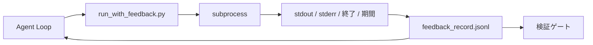

# ランタイムフィードバックループ

> 実際のコマンド出力を見ないエージェントは推測する。フィードバックランナーはstdout、stderr、終了コード、タイミングを構造化されたレコードに捕捉し、次のターンはそれを読むことができる。その時、エージェント は事実に対して反応し、事実の独自の予測に対してではない。

**タイプ:** ビルド
**言語:** Python (stdlib)
**前提条件:** Phase 14 · 32 (最小ワークベンチ)、Phase 14 · 35 (初期化スクリプト)
**所要時間:** 約50分

## 学習目標

- ランタイムフィードバックを観測可能性テレメトリから区別する。
- シェルコマンドをラップし、構造化されたレコードを永続化するフィードバックランナーを構築する。
- 大きな出力を決定論的にトリミングして、ループがトークン予算内に留まるようにする。
- フィードバックが不足しているときはループを進めることを拒否。

## 問題

エージェントは「今テストを実行している」と言う。次のメッセージは「すべてのテストが合格」と言う。現実はテストが実行されなかった。エージェントは出力を想像したか、コマンドを実行して結果を読まなかったか、結果を読んで無声で失敗行を切り詰めた。

フィードバックランナーはそのギャップを削除する。すべてのコマンドがランナーを通過。すべてのレコードはコマンド、キャプチャされたstdoutとstderr、終了コード、ウォールクロック期間、エージェント注を持つ。エージェントは次のターンのレコードを読む。検証ゲートはタスク終了時のレコードを読む。

## コンセプト



### フィードバックレコードに何が入るか

| フィールド | 重要な理由 |
|-------|----------------|
| `command` | 正確なargv、シェル展開サプライズなし |
| `stdout_tail` | 最後のN行、決定論的なトリミング |
| `stderr_tail` | 最後のN行、stdoutから分離 |
| `exit_code` | 明白な成功信号 |
| `duration_ms` | 遅いプローブと暴走プロセスを表示 |
| `started_at` | リプレイ用のタイムスタンプ |
| `agent_note` | エージェントが期待したことについての1行 |

### トリミングは決定論的

50 MBのログはループを破壊。ランナーは`...N行切り詰め...`マーカー付きのヘッドとテールをトリミング、決定論的であり、同じ出力は常に同じレコードを生成。サンプリングなし。エージェントが見る必要があるパーツ（最終エラー、最終サマリー）はテールに存在。

### フィードバック対テレメトリ

テレメトリ（Phase 14 · 23、OTel GenAI規則）は時間をかけて実行をレビューする人間のオペレーター用。フィードバックはこの実行の次のターン用。彼らはフィールドを共有するが、異なるファイルに異なる保有期間で住む。

### フィードバックなしで進むことを拒否

ランナーがキャプチャーの前にエラーが出る場合、レコードは`exit_code: null`と`error: <reason>`を持つ。エージェントループは`null`終了での成功を主張することを拒否する必要がある。終了なし、進捗なし。

## ビルドする

`code/main.py`は以下を実装する：

- `subprocess.run`をラップし、stdout/stderr/終了/期間をキャプチャ、決定論的にトリミング、`feedback_record.jsonl`に追記する`run_with_feedback(command, agent_note)`。
- JSONL をPythonリストにストリームする小さなローダー。
- 3つのコマンド（成功、失敗、遅い）を実行し、コマンドごとの最後のレコードを出力するデモ。

実行する：

```
python3 code/main.py
```

出力：`feedback_record.jsonl`に追記された3つのフィードバックレコード、各印字は各インライン。再実行全体のファイルの尾を見て、ループが蓄積するのを見る。

## 本番環境のパターン

3つのパターンが ランナーを配布に十分なハードンにしている。

**読み込み時ではなく、書き込み時に改定。** stdoutまたはstderrに触れるレコードは秘密を漏らすことができる。ランナーはJSONL追記の前にリダクションパスを配布：`^Bearer `、`password=`、`api[_-]?key=`、`AKIA[0-9A-Z]{16}`（AWS）、`xox[baprs]-`（Slack）に一致する行をストリップ。読み込み時のリダクションは足銃。ディスク上のファイルは攻撃者が到達するもの。リダクションパターンを四半期ごとに本番ランタイムの観察された秘密形式に対して監査。

**単一ファイルではなく回転ポリシー。** `feedback_record.jsonl`を1ファイルごとに1MBでキャップ。オーバーフロー時は`.1`、`.2`に回転、`.5`をドロップ。エージェントのループは現在のファイルのみ読むため、ランタイムコストは制限される。CI アーティファクトストレージは全回転セットを取得。回転なしでファイルはすべてのローダー呼び出しのボトルネックになる。

**再試行チェーン用の親コマンドID。** すべてのレコードが`command_id`を取得。再試行は前の試行を指す`parent_command_id`を持つ。レビュアーの「失敗した試行」リスト（Phase 14 · 40）と検証ゲートの監査の両方がチェーンに従う。このリンクなしで、再試行は独立した成功のように見え、監査は失敗の歴史を隠す。

## 使用する

本番環境のパターン：

- **Claude Code Bash ツール。** ツールはすでにstdout、stderr、終了、期間をキャプチャ。このレッスンのランナーは任意のエージェント製品用のフレームワーク非依存な同等物である。
- **LangGraph ノード。** シェルノードをランナーでラップして、レコードがグラフ状態の外に永続化するようにする。
- **CI ログ。** JSONL をCI アーティファクトストアにパイプ。レビュアーはセッションを再実行することなくコマンドを再生できる。

ランナーはすべてのフレームワークマイグレーションを生き残る薄いラッパーであり、レコードの形状を所有するため。

## 配布する

`outputs/skill-feedback-runner.md`はプロジェクト固有の`run_with_feedback.py`を生成し、正しいトリミング予算で、ワークベンチに配線されたJSONLライター、エージェントがすべてのターンで読むローダー。

## 演習

1. 同じコマンドが異なるディレクトリから実行される場合、区別できるようにレコードごとに`cwd`フィールドを追加。
2. `^Bearer `または`password=`に一致する行をストリップするリダクション`redaction`ステップを追加。フィクスチャレコードでテスト。
3. 合計`feedback_record.jsonl`サイズを`.1`、`.2`ファイルに回転させて1MBでキャップ。回転ポリシーを擁護。
4. リトライチェーンが表示されるように`parent_command_id`を追加：どのコマンドが入力を生成し、次のコマンドが消費したか。
5. JSONL を最新の非ゼロ終了をハイライトする小さいTUIにパイプ。レビューで有用であるためにTUIが表示する必要がある8つの主要な特性。

## キーターム

| ターム | 人々が言うこと | 実際の意味 |
|------|----------------|------------------------|
| フィードバックレコード | 「実行ログ」 | コマンド、出力、終了、期間を持つ構造化JSONL入力 |
| テール切り詰め | 「ログをトリミング」 | 決定論的なヘッド+テール キャプチャ、レコードはトークン予算内 |
| nullで拒否 | 「データ欠落でブロック」 | ループは`exit_code`がnullの場合、進まない必要がない |
| エージェント注 | 「期待タグ」 | 結果を読む前にエージェントが書く1行の予測 |
| テレメトリ分割 | 「2つのログファイル」 | 次のターン用フィードバック、オペレーター用テレメトリ |

## 参考文献

- [OpenTelemetry GenAI semantic conventions](https://opentelemetry.io/docs/specs/semconv/gen-ai/)
- [Anthropic, Effective harnesses for long-running agents](https://www.anthropic.com/engineering/effective-harnesses-for-long-running-agents)
- [Guardrails AI x MLflow — deterministic safety, PII, quality validators](https://guardrailsai.com/blog/guardrails-mlflow) — リダクションパターンをリグレッション テストとして
- [Aport.io, Best AI Agent Guardrails 2026: Pre-Action Authorization Compared](https://aport.io/blog/best-ai-agent-guardrails-2026-pre-action-authorization-compared/) — ツール前後のキャプチャ
- [Andrii Furmanets, AI Agents in 2026: Practical Architecture for Tools, Memory, Evals, Guardrails](https://andriifurmanets.com/blogs/ai-agents-2026-practical-architecture-tools-memory-evals-guardrails) — 観測可能性表面
- Phase 14 · 23 — テレメトリ側のOTel GenAI規則
- Phase 14 · 24 — エージェント観測可能性プラットフォーム（Langfuse、Phoenix、Opik）
- Phase 14 · 33 — 完了を宣言する前にフィードバックを要求するルール
- Phase 14 · 38 — JSONLを読む検証ゲート
