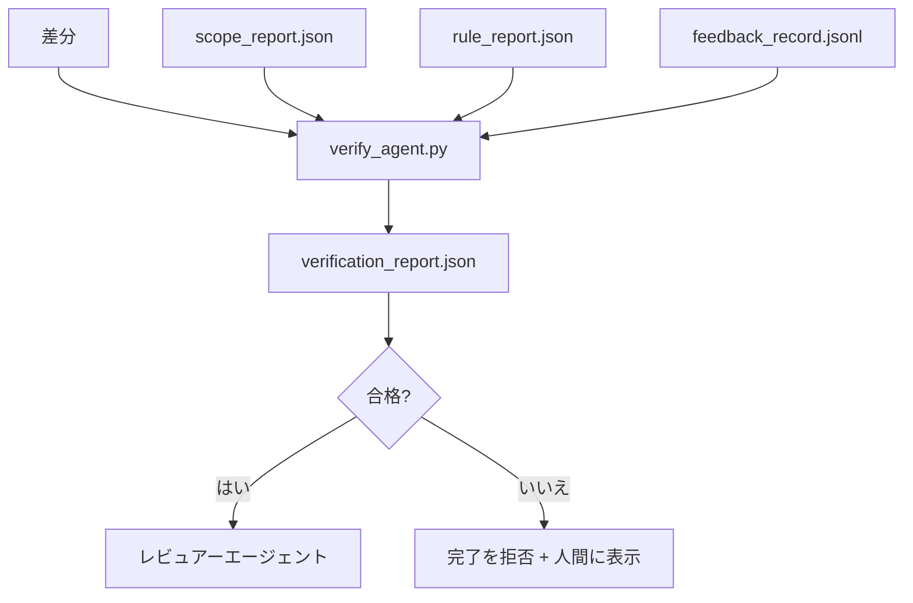

# 検証ゲート

> エージェントは独自の作業を完了としてマークさせない。検証ゲートはスコープ契約、フィードバックログ、ルールレポート、差分を読み、1つの質問に答える：このタスクは実際に完了か？ゲートが「いいえ」と言う場合、タスクは完了ではなく、チャットが言うことに関わらず。

**タイプ:** ビルド
**言語:** Python (stdlib)
**前提条件:** Phase 14 · 33 (ルール)、Phase 14 · 36 (スコープ)、Phase 14 · 37 (フィードバック)
**所要時間:** 約55分

## 学習目標

- 検証ゲートをワークベンチアーティファクト上の決定論的な関数として定義する。
- ルールレポート、スコープレポート、フィードバックレコード、差分を単一の評決に組み合わせる。
- レビュアーエージェントとCIが読むことができる`verification_report.json`を出力。
- ブロック重大度の失敗時にタスクを進めることを拒否し、例外なし。

## 問題

エージェントは成功を簡単に宣言する。3つの失敗形状が支配する：

- 「良さそうだ。」 モデルは独自の差分を読んで、正しかったと判定。
- 「テストが合格。」 自信で言う。テストが実際に実行された記録なし。
- 「受入れが満たされた。」 受入れ基準は「完了のように見えることを意味するほど」緩く解釈。

ワークベンチの修正は、エージェントが既に生成したアーティファクトを読み、呼び出しをする単一の検証ゲートである。ゲートは決定論的。ゲートはバージョン管理。ゲートはCIに配線。エージェントはそれを買収できない。

## コンセプト



### ゲートがチェックするもの

| チェック | ソースアーティファクト | 重大度 |
|-------|-----------------|----------|
| すべての受入れコマンド実行 | `feedback_record.jsonl` | ブロック |
| すべての受入れコマンド終了ゼロ | `feedback_record.jsonl` | ブロック |
| スコープチェック禁止書き込みなし | `scope_report.json` | ブロック |
| スコープチェックスコープ外書き込みなし | `scope_report.json` | ブロック或いは警告 |
| すべてのブロック重大度ルール合格 | `rule_report.json` | ブロック |
| フィードバック内のnull終了コードなし | `feedback_record.jsonl` | ブロック |
| 変更されたファイルは`scope.allowed_files`とマッチ | 両方 | 警告 |

`warn`検出が評決に注釈。`block`検出は`passed: true`を防ぐ。

### 決定論的、確率的ではなく

ゲートは同じ評決セットのために同じ評決セットを毎回生成する必要がある。LLM判定なし。LLM判定はレビュアー側（Phase 14 · 39）に属し、目標は定性的な評価、状態ではない。

### 1つのレポート、1つのパス

ゲートは1つの`verification_report.json`をタスククローズアウトごと出力、`outputs/verification/<task_id>.json`の下に書き込み。CIは同じパスを消費。複数のゲートと異なるパスは情報源を分岐。

### 例外なしに拒否

ブロック重大度検出はエージェントによって上書きされない。記録された`override_reason`と`overridden_by`ユーザーIDを持つ人間によってのみ上書きされ得る。上書きは署名された変更、エージェント決定ではない。

## ビルドする

`code/main.py`は以下を実装する：

- 各入力アーティファクト用ローダー、レッスンがスタンドアロンであるためすべてをローカルにスタブ。
- `verify(task_id, artifacts) -> VerdictReport`純粋関数。
- チェック結果ごとと最終合格/失敗を示すプリンター。
- 3つのタスクシナリオのデモ：クリーン合格、スコープクリープ、受入れなし。

実行する：

```
python3 code/main.py
```

出力：3つの評決レポート、各スクリプトの隣に保存。

## 本番環境のパターン

4つのパターンが「別のリント作業」からゲートを「決定エッジ」に上げている。

**単一ゲートではなく防御の深さ。** プレコミットフック→CI状態チェック→プレツール認可フック→プレマージゲート。各レイヤーは決定論的であり、1つのレイヤーの失敗は次のレイヤーで捕捉される。microservices.ioの2026年3月のプレイブックは明確。プレコミットフックはモデル側スキルと異なり、エージェントが指示に従うことに依存しないため、バイパス不可能。検証ゲートはCI/プレマージレイヤーに座っている。

**確定的なチェックで防御、細かさのためのみモデル判定。** Anthropic の2026年ハイブリッド基準ペアリング：確認可能な報酬（単体テスト、スキーマチェック、終了コード）「コードが問題を解決したか？」に答える。LLMルーブリック「コードは読み取り可能、安全、オンスタイル？」に答える。ゲートは最初のクラスを実行。レビュアー（Phase 14 · 39）は2番目を実行。それらの混合は信号を崩す。

**Slackスレッドではなく署名上書きログ。** すべての上書きが`outputs/verification/overrides.jsonl`の行を出力：タイムスタンプ、検出コード、理由、署名ユーザー、現在のHEADコミット。ランタイムは署名を欠く上書きを拒否。監査証跡はgitで追跡。これは上書きポリシーと上書きシアター間のライン。

**最初クラスのチェックとしてのカバレッジ床。** `coverage_report.json`が`coverage_floor`チェック（デフォルト80%）をフィード。テスト失敗を無声で削除するエージェントはできず、検証レポートは緑のままである。このチェックなし、計測されたカバレッジが床の下に落ちる、または前のマージの床の下に1ポイント以上落ちた場合、ゲートは失敗。

**`--strict`モードは警告をブロックに昇進。** リリースブランチ、配布ブロックPR、事後分類トリアージについて、`--strict`はすべての警告をハード失敗にする。フラグはブランチごとのオプトイン。すべてにストリクトを実行しない、なぜなら厳格が日々のフローを腐食させるから。

## 使用する

本番環境のパターン：

- **CI ステップ。** `verify_agent`ジョブがエージェントの最終アーティファクトに対してゲートを実行。マージ保護は`passed: true`なしで拒否。
- **プレハンドオフフック。** エージェントランタイムはハンドオフドック生成前にゲートを呼び出す。緑の評決がなければ、ハンドオフなし。
- **手動トリアージ。** オペレーターはエージェントが成功を主張してもヒューマンが疑う時のレポートを読む。

ゲートはワークベンチフローの決定エッジ。他のすべての表面はそれの上流である。

## 配布する

`outputs/skill-verification-gate.md`はゲートを特定のプロジェクトに配線：どの受入れコマンドがそれをフィード、どのルールがブロック重大度か、どのスコープ外書き込みが許容可能か、上書き監査ログがどのように保存されるか。

## 演習

1. テストコマンドが80%以上のカバレッジレポートを生成する必要があるという`coverage_floor`チェックを追加。床を持つアーティファクトを決定。
2. すべての`warn`を`block`に昇進させる`--strict`モードをサポート。厳格モードが右デフォルトであるケースを記録。
3. JSONに加えてマークダウンサマリーを生成するようにゲートを作る。サマリーにどのフィールドが属すかを擁護。
4. `time_since_last_human_touch`チェックを追加：人間キーストロークの60秒以内に編集されたファイルはスコープ外フラグから除外。
5. 実際のエージェント差分からゲートを実行。何個の検出が実際で、何個がノイズ？ゲートはどこで成長する必要があるか？

## キーターム

| ターム | 人々が言うこと | 実際の意味 |
|------|----------------|------------------------|
| 検証ゲート | 「ものを止めるチェック」 | ワークベンチアーティファクト上の決定論的な関数、合格/失敗評決を生成 |
| ブロック重大度 | 「ハード失敗」 | `passed: true`を防ぎ、署名上書きを必要とする検出 |
| 上書きログ | 「これを通す理由」 | 理由とユーザーIDで署名されたエントリ、レビューで監査 |
| 受入れコマンド | 「証明」 | ゼロ終了が「完了」の意味であるシェルコマンド |
| 1つのレポートパス | 「情報源」 | `outputs/verification/<task_id>.json`、CIと人間で消費 |

## 参考文献

- [Anthropic, Harness design for long-running application development](https://www.anthropic.com/engineering/harness-design-long-running-apps)
- [OpenAI Agents SDK guardrails](https://platform.openai.com/docs/guides/agents-sdk/guardrails)
- [microservices.io, GenAI dev platform: guardrails](https://microservices.io/post/architecture/2026/03/09/genai-development-platform-part-1-development-guardrails.html) — プレコミットとCI間の防御の深さ
- [ICMD, The 2026 Playbook for Agentic AI Ops](https://icmd.app/article/the-2026-playbook-for-agentic-ai-ops-guardrails-costs-and-reliability-at-scale-1776661990431) — 承認ゲート梯子（ドラフト→承認→しきい値の下で自動）
- [Type-Checked Compliance: Deterministic Guardrails (arXiv 2604.01483)](https://arxiv.org/pdf/2604.01483) — Lean 4を決定論的な門制御の上限として
- [logi-cmd/agent-guardrails — merge gate spec](https://github.com/logi-cmd/agent-guardrails) — スコープ+突然変異テストゲート
- [Guardrails AI x MLflow](https://guardrailsai.com/blog/guardrails-mlflow) — CI スコアラーとしての決定論的なバリデータ
- [Akira, Real-Time Guardrails for Agentic Systems](https://www.akira.ai/blog/real-time-guardrails-agentic-systems) — ツール前後のゲート
- Phase 14 · 27 — プロンプトインジェクション防御（ゲートの敵対的なペア）
- Phase 14 · 36 — このゲートが強制するスコープ契約
- Phase 14 · 37 — このゲートがスコアするフィードバックログ
- Phase 14 · 39 — ゲートがハンドオフするレビュアーエージェント
