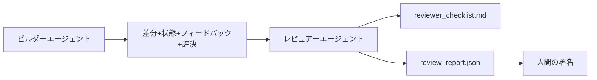

# レビュアーエージェント：ビルダーをマーカーから分離

> コードを書いたエージェントはそれをグレード できない。レビュアーは別のループで、異なるシステムプロンプト、異なるゴール、ビルダーが生成したすべてへの読み取り専用アクセスを持つ。ビルダーとレビュアーの間のギャップはほとんどの信頼性が住む場所である。

**タイプ:** ビルド
**言語:** Python (stdlib)
**前提条件:** Phase 14 · 38 (検証ゲート)
**所要時間:** 約55分

## 学習目標

- 同じエージェントが確実に独自の作業をレビューできない理由を述べる。
- ビルダーアーティファクトを消費し、構造化されたレビューレポートを出力するレビュアーエージェントループを構築する。
- 雰囲気ではなく特定の次元をグレードするレビュアールーブリックを作成。
- ワークベンチにレビュアーを配線して、人間のレビューステップが実際のアーティファクトから始まるようにする。

## 問題

エージェントにバグを修正させる。4つのファイルを編集し、テストを実行、完了を報告。検証ゲート（Phase 14 · 38）は受入れが実行されスコープを保持したことを確認。ゲートは`passed: true`を言う。マージ。2日後にバグの間違った半分を解決したことに気付く。

受入れは必要であり、十分ではない。レビュアーは受入れができない質問をする：これはこのステートメント通りの問題を解決したか？スコープは明らかにフラグなく拡大したか？質問されるべき仮定は書き落とされたか？ワークベンチは次のセッションがきれいに拾える状態に残されたか？

## コンセプト



### レビュアールーブリック

5つの次元、各0から2スコア。

| 次元 | 質問 |
|-----------|----------|
| 問題適合性 | 変更はステートメント通りのタスクを解決したか、近いタスクではなく？ |
| スコープ規律 | 編集は契約に限定されたか、または契約は意図的に成長したか？ |
| 仮定 | すべての隠された仮定はどこか確認可能に書き落とされたか？ |
| 検証品質 | 受入れコマンドは実際にゴールを証明するか、弱いバージョンを証明するか？ |
| ハンドオフ準備 | 次のセッションは現在の状態からきれいに拾えるか？ |

合計10のうち。7未満の実行はソフト失敗。5未満は ハード失敗。

### レビュアーは別の役割、別のモデルではない

ビルダーと同じモデルでレビュアーを実行できる。規律は役割分離：異なるシステムプロンプト、異なる入力、差分への書き込みアクセスなし。姿勢の変更は信号の変更である。

### レビュアーは差分を編集できない

レビュアーは差分、状態、フィードバック、評決を読む。レポートを書く。差分にパッチしない。レポートが「これを修正」と言う場合、次のビルダーターンが修正を行う。レビュアーは再度レビューに行く。役割を混合することは ギャップを破るからそれをする。

### レビュアールーブリック対検証ゲート

ゲート（Phase 14 · 38）は決定論的事実をチェック：受入れが実行されたか、ルール が合格したか、スコープが保持されたか。レビュアーは定性的な判定をする：これは正しい作業だったか、それは文書化されているか、ハンドオフは使用可能か。両方が必須。

## ビルドする

`code/main.py`は以下を実装する：

- レビュアーが読むアーティファクトをバンドルする`ReviewerInputs`データクラス。
- 1つの次元ごとに関数を持つルーブリックスコアラー。各関数は決定論的であり、レッスンの場合はスタブグレード。実装はLLMを呼ぶだろう。
- 5つのスコア、合計、評決（`pass`、`soft_fail`、`hard_fail`）を持つ`review_report.json`ライター。
- 2つのデモケース：クリーン変更、「正しいテスト、間違った問題」変更。

実行する：

```
python3 code/main.py
```

出力：ディスクに書き込まれた2つのレビューレポートと次元スコアのコンソールテーブル。

## 本番環境のパターン

領収書：Cloudflareの2026年4月AIコードレビューシステムは5,169リポジトリの48,095マージリクエストにわたって30日間で131,246レビュー実行を実行。中央値レビューが3分39秒で完了。最大7人のスペシャリストレビュアー（セキュリティ、パフォーマンス、コード品質、ドキュメント、リリース管理、コンプライアンス、Engineering Codex）は レビュー協議官の下で並行実行、重複排除検出と重大度判定。トップティアモデルは協議官に排他的に予約。スペシャリストはより安い階層で実行。

4つのパターンがこれをスケールで機能させる。

**1つの大きなレビュアーではなくスペシャリストプール。** 1つの5次元ルーブリックを持つレビュアーは単独リポジトリに対して機能。一度コードベースがセキュリティ クリティカル、パフォーマンス クリティカル、ドキュメント表面を持つと、より小さなプロンプトを持つスペシャリストに分割。協議官は重複排除を行い、スペシャリストは全ルーブリックを実行しない。モデル階層分離は落ちる：安いスペシャリスト、高価な協議官。

**最適化ではなく設計要件としてのバイアス軽減。** LLM判定は4つの信頼できるバイアスを示す（Adnan Masood、2026年4月）：位置バイアス（GPT-4は(A,B)対(B,A)順序で約40%矛盾）、冗長性バイアス（約15%スコア膨張より長い出力へ）、自己選好（判定は同じモデルファミリーからの出力を選ぶ）、権威（判定は既知著者への参照を過剰評価）。軽減：両順序を評価し、矛盾する勝利のみをカウント。明示的に簡潔さに報酬を与える1-4スケールを使用。モデルファミリーをまわってジャッジをローテ。スコアリング前に著者名をストリップ。

**バイアスではなく較正セット。** 既知の正しい評決を持つ10-20タスク履歴セット。ルーブリックが変わるたびにそれに対してレビュアーを実行。履歴レコードとの一致が80%を下回る場合、ルーブリックはレビュアーが配布する前に改正が必要。これはすべてのチームが最終的に再発見する。最初から開始の方が良い。

**ゲートとのハイブリッド基準。** 検証ゲート（Phase 14 · 38）は決定論的なチェック（受入れが実行されたか、テストが合格したか、スコープが保持されたか）を処理。レビュアーはセマンティックチェック（これは正しい作業だったか、仮定は文書化されているか、ハンドオフは使用可能か）を処理。Anthlopicの2026年ガイダンスはこの分割に明確。レビュアーにゲートが既に証明することをやり直すよう求めないでください。

## 使用する

本番環境のパターン：

- **Claude Code サブエージェント。** レビュアーサブエージェントがビルダークローズとなったタスクの後に実行。PRにルーブリックスコアで コメントを投稿。
- **OpenAI Agents SDK ハンドオフ。** ビルダーはタスク完成時にレビュアーにハンドオフ。レビュアーは検出のリストを持つ人間にハンドオフできる。
- **2モデルペアリング。** ビルダーはより速く安いモデルで実行。レビュアーはより強いモデルでより小さいコンテキスト、判定に焦点を当てて実行。

レビュアーは、人間が自分ですべてのレビューできない時、ワークベンチが成長する2番目の目の組である。

## 配布する

`outputs/skill-reviewer-agent.md`はプロジェクト固有のレビュアールーブリック、ビルダーのアーティファクトに配線されたレビュアーエージェントスタブ、検証ゲートとの統合を生成し、人間のレビューステップが白紙ページではなく書かれたレポートから開始するように。

## 演習

1. 既存の5に吸収されない理由があなたの製品ドメイン固有の6番目の次元を追加。それを擁護。
2. 2つの異なるシステムプロンプト（簡潔、冗長）でレビュアーを実行。人間が読む可能性が高いレポートはどれか？
3. 各次元ごとに`confidence`フィールドを追加。最低の次元の信頼度が0.6未満のとき報告配布を拒否。
4. 較正セットを構築：既知の正しい評決を持つ10個の履歴タスククローズアウト。それに対してレビュアーを実行。それは履歴レコードと どこで不一致か？
5. 「さらに証拠をリクエスト」アフォーダンスを追加：レビュアーはスコアリング前に特定のテスト実行をビルダーに尋ねることができる。正しいバックオフは何であり、これがループしないようにするか？

## キーターム

| ターム | 人々が言うこと | 実際の意味 |
|------|----------------|------------------------|
| レビュアールーブリック | 「チェックリスト」 | 次元ごとに書かれた質問を持つ5次元0-2スコアリング |
| ソフト失敗 | 「改正が必要」 | 7未満の合計。ビルダーは対処する検出を取得 |
| ハード失敗 | 「拒否」 | 5未満の合計または0での任意次元。停止、人間に表示 |
| 役割分離 | 「別のプロンプト」 | 同じモデルは両方の役割になれる。規律は入力と姿勢である |
| 信頼度床 | 「低信号レポートを配布しない」 | ルーブリックが不確実な場合、評決出力を拒否 |

## 参考文献

- [OpenAI Agents SDK handoffs](https://platform.openai.com/docs/guides/agents-sdk/handoffs)
- [Anthropic Claude Code subagents](https://docs.anthropic.com/en/docs/agents-and-tools/claude-code/sub-agents)
- [Cloudflare, Orchestrating AI Code Review at Scale](https://blog.cloudflare.com/ai-code-review/) — 7スペシャリスト+協議官アーキテクチャ、131k実行/30日
- [Agent-as-a-Judge: Evaluating Agents with Agents (OpenReview / ICLR)](https://openreview.net/forum?id=DeVm3YUnpj) — DevAIベンチマーク、366階層的ソリューション要件
- [Adnan Masood, Rubric-Based Evaluations and LLM-as-a-Judge: Methodologies, Biases, Empirical Validation](https://medium.com/@adnanmasood/rubric-based-evals-llm-as-a-judge-methodologies-and-empirical-validation-in-domain-context-71936b989e80) — 4つのバイアスと軽減
- [MLflow, LLM-as-a-Judge Evaluation](https://mlflow.org/llm-as-a-judge) — 分離ビルダー/評価器の本番ツール
- [LangChain, How to Calibrate LLM-as-a-Judge with Human Corrections](https://www.langchain.com/articles/llm-as-a-judge) — 較正セットワークフロー
- [Evidently AI, LLM-as-a-judge: a complete guide](https://www.evidentlyai.com/llm-guide/llm-as-a-judge)
- [Arize, LLM as a Judge — Primer and Pre-Built Evaluators](https://arize.com/llm-as-a-judge/)
- Phase 14 · 05 — Self-Refineとクリティック（単一エージェント自己レビューベースライン）
- Phase 14 · 30 — 評価駆動エージェント開発（較正セット生成器）
- Phase 14 · 38 — レビュアーが読む検証ゲート
- Phase 14 · 40 — レビュアーレポートがフィードするハンドオフパケット
