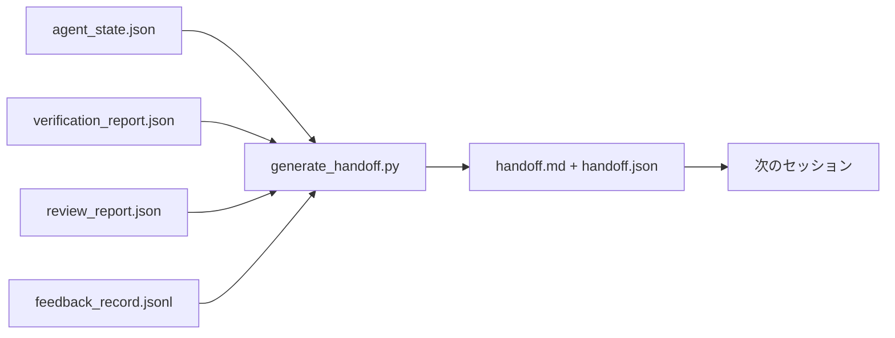

# マルチセッションハンドオフ

> セッションは終わる予定だ。仕事はそうではない。ハンドオフパケットは「エージェントが1時間働いた」を「次のセッションは最初の分で生産的である」に変えるアーティファクトである。それを意図的に構築し、事後考として構築しない。

**タイプ:** ビルド
**言語:** Python (stdlib)
**前提条件:** Phase 14 · 34 (リポジトリメモリ)、Phase 14 · 38 (検証)、Phase 14 · 39 (レビュアー)
**所要時間:** 約50分

## 学習目標

- すべてのハンドオフパケットが必要な7つのフィールドを特定する。
- 手書きのプロズなしでワークベンチアーティファクトからハンドオフを生成する。
- 大きなフィードバックログをハンドオフサイズの概要に トリミング。
- 次のセッションの最初のアクションを決定論的にする。

## 問題

セッションが終わる。エージェントは「素晴らしい、進捗を遂行した」と言う。次のセッションが開く。次のエージェントは「どこに出発したか？」と尋ねる。最初のエージェントの答えは消えた。次のエージェントは再発見し、同じコマンドを再実行、人間に同じ質問を再度尋ね、最後の30秒の前のセッションをからリカバリに30分を燃やす。

悪いハンドオフのコストはセッション毎に、タスクの人生のために支払われる。修正はセッション終了で自動的に生成されたパケット：何が変更されたか、なぜ、何が試された、何が失敗した、何が残ったか、最初に何をするか次にする。

## コンセプト



### すべてのハンドオフが持つ7つのフィールド

| フィールド | 答える質問 |
|-------|---------------------|
| `summary` | 何がなされたかの1段落 |
| `changed_files` | 一目の差分 |
| `commands_run` | 実際に何が実行されたか |
| `failed_attempts` | 試され、機能しなかった理由 |
| `open_risks` | 次のセッションが何が咬むことができるか、重大度で |
| `next_action` | 次のセッションが最初の具体的なステップを取る |
| `verdict_pointer` | 検証+レビューレポートへのパス |

`next_action`フィールドは負荷ベアリングである。`next_action`以外のすべてを持つハンドオフは状態レポート、ハンドオフではない。

### ハンドオフは書かれた、生成された

手書きされたハンドオフは、ハードな日にスキップされるハンドオフである。ジェネレーターはワークベンチアーティファクトを読み、パケットを出力。エージェントのジョブはサマリーを書くのではなく、ジェネレーターが要約できる状態でワークベンチを放置することである。

### 2つの形式：人間可読と機械可読

`handoff.md`は人間が読む。`handoff.json`は次のエージェントが読み込む。両方は同じソースアーティファクトから来ている。それらが分岐する場合、JSONが勝つ。

### フィードバックログトリミング

フルの`feedback_record.jsonl`は数百エントリになることができる。ハンドオフは最後のKプラスすべての非ゼロ終了エントリだけを持つ。次のセッションが必要な場合、フルログをロードできるが、パケットは小さいままである。

## ビルドする

`code/main.py`は以下を実装する：

- 状態、評決、レビュー、フィードバックを単一の`WorkbenchSnapshot`に集める ローダー。
- `generate_handoff(snapshot) -> (markdown, payload)`関数。
- 最後のK フィードバックエントリプラスすべての非ゼロ終了を拾うフィルター。
- `handoff.md`と`handoff.json`をスクリプトの隣に書き込むデモ実行。

実行する：

```
python3 code/main.py
```

出力：プリントされたハンドオフボディ、プラスディスク上の両方ファイル。

## 本番環境のパターン

Codex CLI、Claude Code、OpenCodeそれぞれは異なるコンパクション物語を配布。構造化されたハンドオフパケットは3つすべての上に座っている。

**コンパクション戦略は変わる。パケットスキーマは変わらない。** Codex CLIのPOST /v1/responses/compactはサーバー側の不透明なAESブロブ（OpenAIモデルの高速パス）。フォールバックはローカル「ハンドオフサマリー」として`_summary`ユーザーロールメッセージに追記。Claude Codeは95%のコンテキストで5段階的なプログレッシブコンパクションを実行。OpenCodeはタイムスタンプベースのメッセージ隠ぺいプラス5見出しLLMサマリーを行う。3つの異なるメカニズム、同じニーズ：圧縮で何が生き残るかをポータブルなアーティファクトにシリアライズ。パケットがそれである。

**新規セッションハンドオフは圧縮ではない。** コンパクションはセッションを拡張。ハンドオフは1つをクリーンに閉じ、次を開始。Hermesの問題#20372フレーミング（2026年4月）は正しい：インプレースコンプレッション品質が低下し始めるとき、エージェントはコンパクトなハンドオフを書き、セッション を終了、新しいコンテキストで再開。パケットはその遷移を安く作る。ミステークは圧縮まで続けることであり、品質が崩壊するまで。修正はブリーコンパクション終了でハンドオフ を予算するべきであり、壁で。

**ブランチとトピックごとに1つのアクティブハンドオフ。** マルチエージェント調整は悪いモデル出力より古いハンドオフで落ちる。常に`branch`、`last_known_good_commit`、ステータスの`active | superseded | archived`を含める。古いハンドオフはアーカイブ。アクティブなものだけが次のセッションを駆動。これはハンドオフのノート とハンドオフのような状態の違い。

**50-75%コンテキストで、壁で終了ではなく。** 手書きパターンのプレイブック（CLAUDE.md + HANDOVER.md）は最良の結果をセッションが50-75%コンテキスト予算で終了した場合 報告、95%ではなく。パケットジェネレーターはコンテキストが完全な間きれいに実行。スターと書く。圧縮アーティファクトが既にモデルを失うか失わせるときに高価。

## 使用する

本番環境のパターン：

- **セッション終了フック。** ランタイムはユーザーがチャットを閉じるとジェネレーターを点火。パケットは`outputs/handoff/<session_id>/`に行く。
- **PR テンプレート。** ジェネレーターのマークダウンはPRボディである。レビュアーは5つの他のファイルを開かずにそれを読む。
- **クロスエージェントハンドオフ。** 1つの製品（Claude Code）でビルド、別のもの（Codex）で続ける。パケットはリングア フランカ。

パケットは小さく、規則的で、生産に安い。コスト節約はセッションごと複合。

## 配布する

`outputs/skill-handoff-generator.md`はプロジェクトのアーティファクトパスに調整されたジェネレーターを生成、それを実行するセッション終了フック、次のエージェントがスタートアップで読む`handoff.json`スキーマ。

## 演習

1. ビルダーが ログしたがレビュアーが1の上でスコアしなかった仮定を表示する`assumptions_to_validate`フィールドを追加。
2. 失敗実行対成功実行のためにフィードバックサマリーを異なってトリミング。非対称性を擁護。
3. 「人間への質問」リストを含める。パケットに出ずよりチャットメッセージに出るためのしきい値は何か？
4. ジェネレーターをべき等にする：2回実行すると同じパケットを生成。そのことを保持するために何が安定している必要があるか？
5. 「次のセッション要件」セクションを追加し、次のセッションが行動する前にロードする必要がある正確なアーティファクトをリストする。

## キーターム

| ターム | 人々が言うこと | 実際の意味 |
|------|----------------|------------------------|
| ハンドオフパケット | 「セッションサマリー」 | 7つのフィールド、マークダウン+JSONを持つ生成されたアーティファクト |
| 次のアクション | 「次に何をするか」 | 次のセッションを開始する1つの具体的なステップ |
| フィードバック切り詰め | 「ログサマリー」 | 最後のKレコードプラスすべての非ゼロ終了 |
| 状態レポート | 「何をしたか」 | `next_action`を欠く文書。有用だが、ハンドオフではない |
| 評決ポインター | 「領収書」 | 追跡可能性のための検証+レビューレポートへのパス |

## 参考文献

- [Anthropic, Effective harnesses for long-running agents](https://www.anthropic.com/engineering/effective-harnesses-for-long-running-agents)
- [OpenAI Agents SDK handoffs](https://platform.openai.com/docs/guides/agents-sdk/handoffs)
- [Codex Blog, Codex CLI Context Compaction: Architecture, Configuration, Managing Long Sessions](https://codex.danielvaughan.com/2026/03/31/codex-cli-context-compaction-architecture/) — POST /v1/responses/compactとローカルフォールバック
- [Justin3go, Shedding Heavy Memories: Context Compaction in Codex, Claude Code, OpenCode](https://justin3go.com/en/posts/2026/04/09-context-compaction-in-codex-claude-code-and-opencode) — 3ベンダーコンパクション比較
- [JD Hodges, Claude Handoff Prompt: How to Keep Context Across Sessions (2026)](https://www.jdhodges.com/blog/ai-session-handoffs-keep-context-across-conversations/) — CLAUDE.md + HANDOVER.md、50-75%コンテキスト予算
- [Mervin Praison, Managing Handoffs in Multi-Agent Coding Sessions: Fresh Context Without Losing Continuity](https://mer.vin/2026/04/managing-handoffs-in-multi-agent-coding-sessions-fresh-context-without-losing-continuity/) — 分散システムフレーミング
- [Hermes Issue #20372 — automatic fresh-session handoff when compression becomes risky](https://github.com/NousResearch/hermes-agent/issues/20372)
- [Hermes Issue #499 — Context Compaction Quality Overhaul](https://github.com/NousResearch/hermes-agent/issues/499) — Codex CLIの指向プロンプト
- [Microsoft Agent Framework, Compaction](https://learn.microsoft.com/en-us/agent-framework/agents/conversations/compaction)
- [OpenCode, Context Management and Compaction](https://deepwiki.com/sst/opencode/2.4-context-management-and-compaction)
- [LangChain, Context Engineering for Agents](https://www.langchain.com/blog/context-engineering-for-agents)
- Phase 14 · 34 — ジェネレーターが読む状態ファイル
- Phase 14 · 38 — パケットが指す検証評決
- Phase 14 · 39 — パケットにバンドルされたレビュアーレポート
