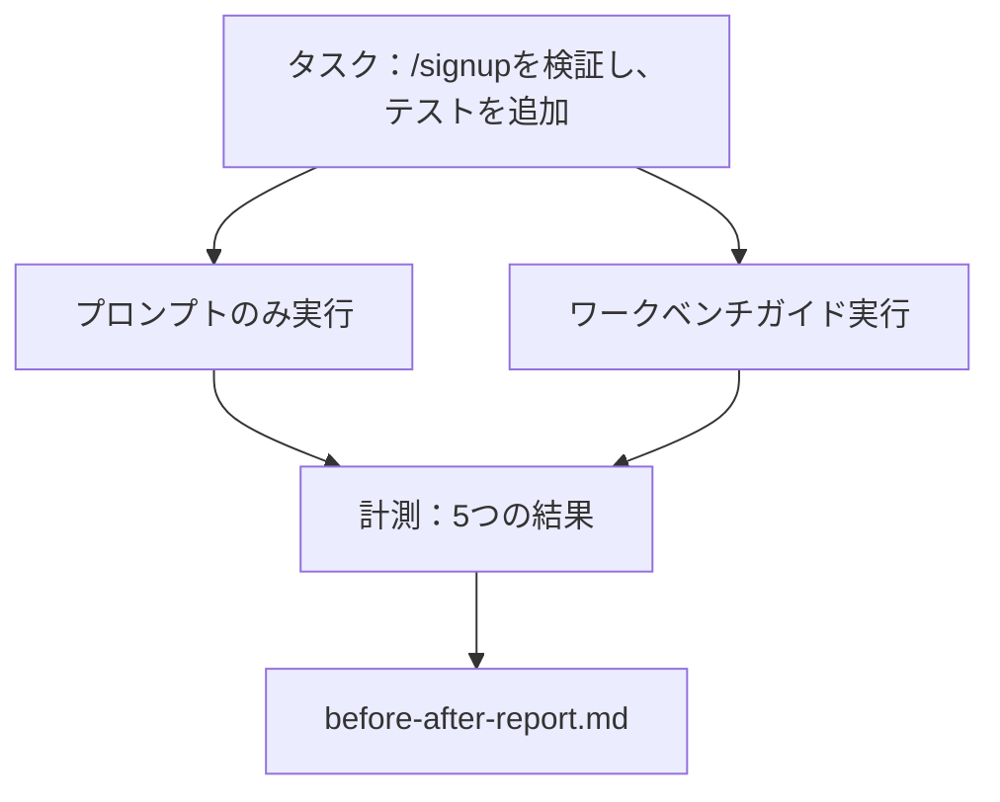

# 実際のリポジトリ上のワークベンチ

> 表面の11レッスンは、実際のコードベースとの接触で生き残らない場合、何も価値がない。このレッスンは同じタスクを小さなサンプルアプリの上で2回実行。プロンプトのみ対ワークベンチガイド。数字が議論している。

**タイプ:** ビルド
**言語:** Python (stdlib)
**前提条件:** Phases 14 · 32～14 · 40
**所要時間:** 約60分

## 学習目標

- 7つのワークベンチ表面を小さなアプリケーション上に持ってくる。
- 同じタスクを2回実行（プロンプトのみとワークベンチガイド）して5つの結果を計測。
- 前後レポートを読み、最大レバレッジを与えた表面を決定。
- 「しかし私のモデルは十分に良い」押し返しに対してワークベンチを擁護。

## 問題

おもちゃタスクのデモは誰も納得させない。ワークベンチのケースは、実際の感じのタスクが実際の感じのリポ上で本番環境に着地し、より少ない失敗、より少ないリバート、次のセッションが使用できるパケットが作られた場合に作成される。

このレッスンはその実際の感じのリポを配布し、両方のパイプラインを通して同じタスクを実行。結果は懐疑的に渡すことができる前後のレポート。

## コンセプト



### サンプルアプリ

`sample_app/`内の最小のFastAPIスタイルハンドラー：

- `/signup`（まだ検証なし）を持つ`app.py`。
- 1つのハッピーパステストで`test_app.py`。
- `README.md`と`scripts/release.sh`を禁止ゾーン餌として。

### タスク

> 入力検証を`/signup`に追加：8文字より短いパスワードを拒否、型指定されたエラーエンベロープで422を返す。新しい動作を証明するテストを追加。

### 2つのパイプライン

プロンプトのみ：

1. README を読む。
2. `app.py`を読む。
3. ファイルを編集。
4. 完了を主張。

ワークベンチガイド：

1. 初期化スクリプトを実行（レッスン35）。
2. スコープ契約を読む（レッスン36）。
3. 状態を読む（レッスン34）。
4. 許可されたファイルのみを編集。
5. フィードバックランナー経由受入れコマンドを実行（レッスン37）。
6. 検証ゲートを実行（レッスン38）。
7. レビュアーを実行（レッスン39）。
8. ハンドオフを生成（レッスン40）。

### 計測される5つの結果

| 結果 | 重要な理由 |
|---------|----------------|
| `tests_actually_run` | 最大の「テスト合格」クレームは検証不可能 |
| `acceptance_met` | ゴールを証明するテストはテストが実行した必要がある |
| `files_outside_scope` | スコープクリープは支配的な無声失敗 |
| `handoff_quality` | 次のセッションはこのから利益を受ける、あるいは費用を支払う |
| `reviewer_total` | ゲートの上の定性的な判定 |

## ビルドする

`code/main.py`は同じサンプルアプリフィクスチャに対して2つのパイプラインをオーケストレート。両方のパイプラインはスクリプトされ（ループ内のLLMなし）、計測は再現可能。スクリプトは比較を`before-after-report.md`と`comparison.json`に書き込む。

実行する：

```
python3 code/main.py
```

出力：パイプラインごとの結果のコンソールテーブル、スクリプトの隣に保存されたマークダウンレポート、それをチャート化したい人のためのJSON。

## 本番環境のパターン

懐疑的な質問は「ワークベンチは実際にどのくらい助けるか？」である。2026年の数字は説明よりも多くを言う。

**ターミナルベンチTOP-30からTOP-5同じモデルで。** LangChainの*Anatomy of an Agent Harness*（2026年4月）：コーディングエージェントはハーネスのみを変えることで30外から5位に飛び降りた。同じモデル。異なる表面。25位のデルタ。

**Vercel 80%から100%ツール削除で。** Vercelは80%のエージェントツール削除を報告し、成功率は80%から100%に移動。より小さいツール表面、より鋭いスコープ、失敗するより少ない方法。ネガティブスペース勝つ。

**Harvey 2倍精度ハーネスだけで。** 法的エージェントはハーネス最適化を通じて精度を2倍以上にしており、モデル変更なし。

**エンタープライズAIエージェントプロジェクトの88%本番環階に到達失敗。** preprints.org*Harness Engineering for Language Agents*論文（2026年3月）は失敗を推論ではなくランタイムにトレース：古い状態、脆い再試行、成長したコンテキスト、中間のミステークから悪い回復。

**長いコンテキスト崩壊。** WebAgentベースラインの40-50%成功は長いコンテキスト条件下で10%未満に落ちる、主に無限ループとゴール喪失から。Ralph Loopとハンドオフパケットはそれを吸収する存在。

**偽陰性がまだ存在。** 単一ステップ事実タスク、1行のリント、フォーマッター実行、モデルが逐語的に暗記した何か、これらはプロンプトのみでより高速に実行。ベンチマークはそれらを正直に列挙すべき、ワークベンチがオーバーキルとしてフレームされないように。

主要取得はハーネスが永遠に勝つことではない。モデルはハーネストリックを時間をかけて吸収する。主要取得は今、工学負荷は7つの表面に座り、数字はそれを証明するということである。

## 使用する

このレッスンは以下の場合に引用するケースファイルである：

- 誰かが、なぜすべてのPRが`agent-rules.md`とスコープ契約を持つのかを尋ねる。
- チームはこのスプリント用に検証ゲートをドロップしたいと思っている。
- 新しいエージェント製品が起動し、実際に時間を節約するかどうかのポータブルベンチマークが必要。

数字は説明より遠くに移動。

## 配布する

`outputs/skill-workbench-benchmark.md`はポータブルな評価ハーネスであり、任意のエージェント製品を両方のパイプラインに対してプロジェクト独自のサンプルアプリに対して実行し、5つの結果を報告。

## 演習

1. 6番目の結果を追加：最初の意味のあるハッシュまでの時間。どのようにきれいにそれを計測するか？
2. あなたのコードベースの実際の第2日目タスクで比較を実行。ワークベンチ数がどこで滑るか？
3. 「偽陰性」パス追加：プロンプトのみが高速だったタスク、ワークベンチオーバーヘッドが実際のコストである。それでもワークベンチを保つことを擁護。
4. スクリプトされた「エージェント」を実際のLLM呼び出しで交換。どの結果がより騒々しくなるか？
5. 非エンジニアを対象にした1ページサマリーを作成。何がカットで生き残るか？

## キーターム

| ターム | 人々が言うこと | 実際の意味 |
|------|----------------|------------------------|
| サンプルアプリ | 「おもちゃのレポ」 | 小さいが、すべての7つの表面を実行できるほど現実的 |
| パイプライン | 「ワークフロー」 | エージェントが従う表面の読み/書きの順序付きシーケンス |
| 前後レポート | 「領収書」 | 懐疑的に渡すアーティファクト |
| 偽陰性 | 「ワークベンチオーバーキル」 | プロンプトのみがより高速なタスク。誠実に列挙するのに有用 |
| ワークベンチベンチマーク | 「信頼性スコア」 | ポータブルハーネスがあなたのコードベースで比較を実行 |

## 参考文献

- [LangChain, The Anatomy of an Agent Harness](https://blog.langchain.com/the-anatomy-of-an-agent-harness/) — ターミナルベンチTOP-30からTOP-5領収書
- [MongoDB, The Agent Harness: Why the LLM Is the Smallest Part of Your Agent System](https://www.mongodb.com/company/blog/technical/agent-harness-why-llm-is-smallest-part-of-your-agent-system) — Vercel + Harvey数字
- [preprints.org, Harness Engineering for Language Agents](https://www.preprints.org/manuscript/202603.1756) — 88%エンタープライズ失敗率、ランタイム根本原因
- [HN: Improving 15 LLMs at Coding in One Afternoon. Only the Harness Changed](https://news.ycombinator.com/item?id=46988596) — 15モデル全体で複製
- [Cloudflare, Orchestrating AI Code Review at Scale](https://blog.cloudflare.com/ai-code-review/) — 本番環境で131k レビュー実行/30日
- [Anthropic, Building Effective Agents](https://www.anthropic.com/research/building-effective-agents)
- Phases 14 · 32～14 · 40 — このレッスンが終了を実行する表面
- Phase 14 · 19 — SWE-bench、GAIA、AgentBenchが、このレッスンが補完するマクロベンチマーク
- Phase 14 · 30 — 同じハーネスがプラグインする評価駆動エージェント開発
