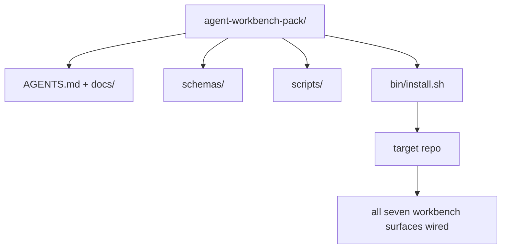

# キャップストーン: 再利用可能なエージェント ワークベンチ パックの納品

> ミニトラックは、任意のリポジトリに導入できるパックで終了します。11 のレッスンから生まれた表面をディレクトリに圧縮して、`cp -r` でコピーして翌朝にはエージェントが確実に動作するようになります。キャップストーンは、このカリキュラムが提供する成果物です。

**タイプ:** ビルド
**言語:** Python (標準ライブラリ)
**前提条件:** フェーズ 14 · 31 から 14 · 41
**所要時間:** 約 75 分

## 学習目標

- 7 つのワークベンチ表面を 1 つのドロップイン ディレクトリにパッケージ化する。
- スキーマ、スクリプト、テンプレートをピンして、新しいリポジトリが既知の良いベースラインを取得するようにする。
- パックをべき等に配置する単一のインストーラー スクリプトを追加する。
- パックに何を含めるか、何を除外するかを決定し、各カットに対する理由を説明する。

## 問題

Google ドキュメント、チャット履歴、3 つの半ば忘れられたスクリプトに存在するワークベンチは、四半期ごとに再構築されるワークベンチです。治療法はバージョン管理されたパック、つまり表面、スキーマ、スクリプト、および 1 つのコマンド インストーラーを含むリポジトリまたはディレクトリです。

このレッスンを終了すると、`outputs/agent-workbench-pack/` がディスク上に納品され、`bin/install.sh` がそれを任意のターゲット リポジトリに配置します。

## コンセプト



### パックレイアウト

```
outputs/agent-workbench-pack/
├── AGENTS.md
├── docs/
│   ├── agent-rules.md
│   ├── reliability-policy.md
│   ├── handoff-protocol.md
│   └── reviewer-rubric.md
├── schemas/
│   ├── agent_state.schema.json
│   ├── task_board.schema.json
│   └── scope_contract.schema.json
├── scripts/
│   ├── init_agent.py
│   ├── run_with_feedback.py
│   ├── verify_agent.py
│   └── generate_handoff.py
├── bin/
│   └── install.sh
└── README.md
```

### 何を含めるか、何を除外するか

含める:

- 表面スキーマ。これらは契約です。
- 上記の 4 つのスクリプト。これらはランタイムです。
- 4 つのドキュメント。これらはルールと評価基準です。

除外:

- プロジェクト固有のタスク。タスクはパックではなく、ターゲット リポジトリのボードに属しています。
- ベンダー SDK 呼び出し。パックはフレームワーク不可知です。
- オンボーディング散文。パックはチームの既存のオンボーディングの内部ではなく、その隣に存在します。

### インストーラー

短い `bin/install.sh` (または `bin/install.py`):

1. `--force` がない限り、既存のパックへのインストールを拒否します。
2. パックをターゲット リポジトリにコピーします。
3. `.github/workflows/` が存在する場合、CI をセットアップします。
4. 次のステップを出力します: ボードを入力し、受け入れコマンドを設定し、初期化スクリプトを実行します。

### バージョン管理

パックは `VERSION` ファイルを含みます。スキーマのバンプとマイグレーションが必要なスクリプト変更は、メジャーバージョンをバンプします。ドキュメントのみの変更はパッチをバンプします。ターゲット リポジトリの `agent_state.json` は、初期化されたときのパック バージョンを記録します。

## それを構築する

`code/main.py` は、パックをレッスンの横にある `outputs/agent-workbench-pack/` に組み立て、このミニ トラックの前のレッスンのスキーマとスクリプト、および既に作成したドキュメントでシードします。

実行:

```
python3 code/main.py
```

スクリプトは表面をコピーしてピンし、README を書き、パック ツリーを出力し、ゼロで終了します。再実行はべき等です。

## 本番パターン

パックは、フォーク、アップデート、および敵対的なアップストリームを保つ場合にのみ価値があります。4 つのパターンがそれを機能させます。

**`VERSION` はマーケティングではなく契約です。** メジャー バンプはステート マイグレーションが必要です。マイナー バンプはチェッカーの再実行が必要です。パッチ バンプはドキュメントのみです。インストーラーはすべてのインストールで `.workbench-version` をターゲット リポジトリに書き込みます。`lint_pack.py` は、ターゲットのロックがパックの `VERSION` と一致しない場合、出荷を拒否します。これは、`npm`、`Cargo`、`pyproject.toml` が 10 年の変化を乗り切る方法です。エージェントについて何も変わっていません。

**クロスツール分布の単一ソース。** Nx は 1 つの `nx ai-setup` を出荷します。このコマンドは、1 つの設定から `AGENTS.md`、`CLAUDE.md`、`.cursor/rules/`、`.github/copilot-instructions.md`、および MCP サーバーを配置します。パックも同じことをする必要があります。インストーラーはシンボリック リンクを出力します (`ln -s AGENTS.md CLAUDE.md`)。単一の真実のソースが、すべてのコーディング エージェントに拡散します。パックをフォークして 1 つのツールをサポートすることは、失敗モードです。

**`uninstall.sh` が非自明なステートで拒否します。** パックのアンインストールは、ユーザーの `agent_state.json`、`task_board.json`、または `outputs/` を削除してはいけません。アンインストーラーはスキーマ、スクリプト、ドキュメント、`AGENTS.md` を削除します (`--keep-agents-md` オプトアウト) します。ステート ファイルにコミットされていない変更がある場合は、処理を拒否します。ステートはユーザーに属しており、パックはそれを所有しません。

**SkillKit スタイルの配布としてのスキル。** パックは SkillKit スキルとして出荷します: `skillkit install agent-workbench-pack` は、1 つのソースから 32 個の AI エージェント全体に配置します。パック リポジトリは真実のソースです。SkillKit は配布チャネルです。ベンダー ロックインは崩壊します。7 つの表面は同じままです。

## それを使用する

パックが出荷される 3 つの場所:

- **リポジトリにドロップするディレクトリとして。** `cp -r outputs/agent-workbench-pack /path/to/repo`。
- **パブリック テンプレート リポジトリとして。** フォークしてカスタマイズします。`VERSION` がドリフトを制御します。
- **SkillKit スキルとして。** エージェント製品にワイヤリングして、1 つのコマンドでそれを配置します。

パックはレシピです。各インストールは提供です。

## それを納品する

`outputs/skill-workbench-pack.md` は、プロジェクト調整されたパックを生成します: チームの履歴に合わせてシャープになったルール、リポジトリと一致するスコープ グロブ、1 つのドメイン固有のエントリで拡張された評価基準の寸法。

## 演習

1. 正規パックへの昇進に値する 5 番目のオプション ドキュメントを決定します。カットを説明します。
2. インストーラーを Python として `--dry-run` フラグで書き直します。bash に対する人間工学を比較します。
3. パックを安全に削除し、ステート ファイルに非自明な履歴がある場合は拒否する `bin/uninstall.sh` を追加します。非自明とは何ですか?
4. パックが `VERSION` からドリフトする場合に失敗する `lint_pack.py` を追加します。パック独自のリポジトリの CI にワイヤリングします。
5. 手動ロール ワークベンチからこのパックへのマイグレーション ランブックを作成します。ダウンタイムを最小化する操作の順序は何ですか?

## キー用語

| 用語 | 人々は何と言うか | それは実際には何を意味するのか |
|------|----------------|------------------------|
| ワークベンチ パック | 「スターター キット」 | すべての 7 つの表面を含むバージョン管理されたディレクトリ |
| インストーラー | 「セットアップ スクリプト」 | `bin/install.sh` がパックをべき等に配置する |
| パック バージョン | 「VERSION」 | スキーマ/スクリプト変更の場合はメジャー バンプ、ドキュメントのみの場合はパッチ |
| ドロップイン パック | 「cp -r して移動」 | パックは最初の日にリポジトリごとのカスタマイズなしで機能する |
| フォーク可能なテンプレート | 「GitHub テンプレート」 | GitHub の「このテンプレートを使用」がクローンできるパブリック リポジトリ |

## 参考文献

- フェーズ 14 · 31 から 14 · 41 — このパックがバンドルするすべての表面
- [SkillKit](https://github.com/rohitg00/skillkit) — 32 個の AI エージェント全体にこのスキルをインストール
- [Nx ブログ、Monorepo で AI エージェントに作業方法を教える](https://nx.dev/blog/nx-ai-agent-skills) — 6 つのツール全体で単一ソース ジェネレータ
- [agents.md — オープン仕様](https://agents.md/) — パックのルータが実装する必要があるもの
- [HKUDS/OpenHarness](https://github.com/HKUDS/OpenHarness) — パック相当の参考実装
- [andrewgarst/agentic_harness](https://github.com/andrewgarst/agentic_harness) — Redis サポート付き参考実装 (評価スイート付き)
- [Augment Code、良い AGENTS.md はモデル アップグレード](https://www.augmentcode.com/blog/how-to-write-good-agents-dot-md-files) — パック ドキュメント品質基準
- [Anthropic、長時間実行エージェントの有効なハーネス](https://www.anthropic.com/engineering/effective-harnesses-for-long-running-agents)
- [Anthropic、長時間実行アプリケーション開発のハーネス設計](https://www.anthropic.com/engineering/harness-design-long-running-apps)
- フェーズ 14 · 30 — パックの検証ゲートを使用する評価駆動型エージェント開発
- フェーズ 14 · 41 — このパックが改善する前後のベンチマーク
