# コミュニケーション・プロトコル

> 同じ言語を話すことができないエージェントはチームではない。彼らは虚空に叫ぶ見知らぬ人である。

**タイプ:** Build
**言語:** TypeScript
**前提条件:** Phase 14 (Agent Engineering), Lesson 16.01 (Why Multi-Agent)
**所要時間:** ~120 minutes

## 学習目標

- MCPツール検出と呼び出しを実装し、エージェントが外部サーバーによって公開されたツールを使用できるようにする
- A2Aエージェントカードとタスク・エンドポイントを構築し、1つのエージェントがHTTP経由で別のエージェントに作業を委任できるようにする
- MCP（ツール・アクセス）、A2A（エージェント間）、ACP（エンタープライズ監査）、ANP（分散型信頼）を比較して説明し、どのプロトコルがどの問題を解決するかを説明する
- 複数のプロトコルを単一のシステムに接続して、エージェントがMCP経由でツールを検出し、A2A経由でタスクを委任できるようにする

## 問題

システムを複数のエージェントに分割した。研究者、コーダー、レビューア。彼らは個々の仕事に向いている。しかし今、彼らは実際に互いに話す必要がある。

最初の試みは明白である。文字列を周りで渡す。研究者はテキストのブロブを返し、コーダーはできるだけ解析する。コーダーが研究要約を誤釈義するか、2つのエージェントが互いに待機してデッドロックするか、異なるチームによって構築されたエージェントが協力する必要があるまで機能する。突然「ただ文字列を渡す」が崩壊する。

これが通信プロトコルの問題である。エージェントがどのように情報を交換するかについて共有契約がなければ、マルチエージェントシステムは脆弱で、監査不可能で、個人的に書いたいくつかのエージェントを超えてスケールすることは不可能である。

AIエコシステムは4つのプロトコルで対応した。各プロトコルは問題の異なるスライスを解決する。

- **MCP** ツール・アクセス用
- **A2A** エージェント間協力用
- **ACP** エンタープライズ監査用
- **ANP** 分散型アイデンティティと信頼用

このレッスンは深い。各仕様からリアル・ワイヤ形式を読み、実装例を構築し、4つを統一システムに接続する。

## コンセプト

### プロトコル・ランドスケープ

これら4つのプロトコルをレイヤーとして考える。それぞれが異なる質問に対応する。

```mermaid
block-beta
  columns 1
  block:ANP["ANP — How do agents trust strangers?\nDecentralized identity (DID), E2EE, meta-protocol"]
  end
  block:A2A["A2A — How do agents collaborate on goals?\nAgent Cards, task lifecycle, streaming, negotiation"]
  end
  block:ACP["ACP — How do agents talk in auditable systems?\nRuns, trajectory metadata, session continuity"]
  end
  block:MCP["MCP — How does an agent use a tool?\nTool discovery, execution, context sharing"]
  end

  style ANP fill:#f3e8ff,stroke:#7c3aed
  style A2A fill:#dbeafe,stroke:#2563eb
  style ACP fill:#fef3c7,stroke:#d97706
  style MCP fill:#d1fae5,stroke:#059669
```

彼らは競合者ではない。彼らは異なるレベルで異なる問題を解決する。

### MCP（復習）

MCPはPhase 13で詳しく取り上げている。クイック復習。MCPはLLMが外部ツールとデータソースに接続する方法を標準化する。これは**クライアント・サーバー**プロトコルであり、エージェント（クライアント）はサーバーによって公開されたツールを検出および呼び出す。

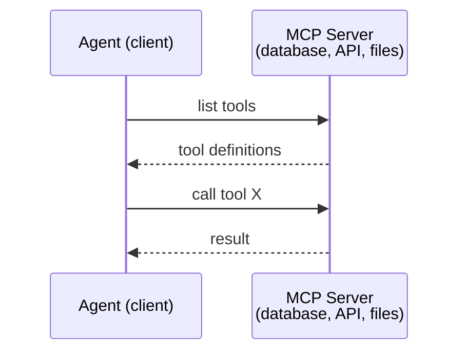

MCPは**エージェント間ツール**通信である。エージェント間の通信に役立たない。

### A2A (Agent2Agent Protocol)

**作成者:** Google (現在はLinux Foundationの下で `lf.a2a.v1`)
**仕様バージョン:** 1.0.0
**問題:** 自律エージェントが協力、交渉、互いにタスクを委任する方法は?

A2Aは**ピアツーピア・エージェント協力**用のプロトコルである。MCPがエージェントをツールに接続する場合、A2Aはエージェントを他のエージェントに接続する。各エージェントは既知のURLで**エージェント・カード**を発行し、他のエージェントがそれを検出、交渉、委任する。

#### A2Aの動作方法

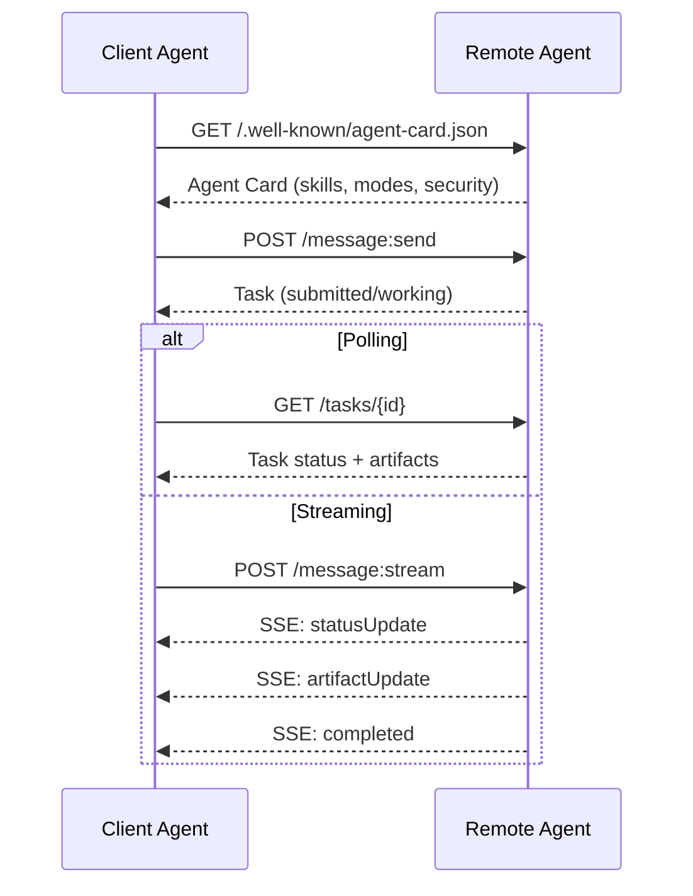

#### 実際のエージェント・カード

これはA2Aエージェント・カードが野生でどのように見えるかである。`GET /.well-known/agent-card.json`で提供される。

```json
{
  "name": "Research Agent",
  "description": "Searches documentation and summarizes findings",
  "version": "1.0.0",
  "supportedInterfaces": [
    {
      "url": "https://research-agent.example.com/a2a/v1",
      "protocolBinding": "JSONRPC",
      "protocolVersion": "1.0"
    },
    {
      "url": "https://research-agent.example.com/a2a/rest",
      "protocolBinding": "HTTP+JSON",
      "protocolVersion": "1.0"
    }
  ],
  "provider": {
    "organization": "Your Company",
    "url": "https://example.com"
  },
  "capabilities": {
    "streaming": true,
    "pushNotifications": false
  },
  "defaultInputModes": ["text/plain", "application/json"],
  "defaultOutputModes": ["text/plain", "application/json"],
  "skills": [
    {
      "id": "web-research",
      "name": "Web Research",
      "description": "Searches the web and synthesizes findings",
      "tags": ["research", "search", "summarization"],
      "examples": ["Research the latest changes in React 19"]
    },
    {
      "id": "doc-analysis",
      "name": "Documentation Analysis",
      "description": "Reads and analyzes technical documentation",
      "tags": ["docs", "analysis"],
      "inputModes": ["text/plain", "application/pdf"],
      "outputModes": ["application/json"]
    }
  ],
  "securitySchemes": {
    "bearer": {
      "httpAuthSecurityScheme": {
        "scheme": "Bearer",
        "bearerFormat": "JWT"
      }
    }
  },
  "security": [{ "bearer": [] }]
}
```

注目することの重要なことら。

- **スキル**はエージェントができることである。それぞれはID、タグ、およびサポートされている入出力MIMEタイプを持つ。これはクライアント・エージェントが他のリモート・エージェントがそのリクエストを処理できるかどうかを決定する方法である。
- **supportedInterfaces**は複数のプロトコル・バインディングをリストします。単一のエージェントは同時にJSON-RPC、REST、gRPCを話すことができる。
- **セキュリティ**はカードに組み込まれている。クライアントは単一のリクエストを行う前に必要な認証を知っている。

#### タスク・ライフサイクル

タスクはA2Aの作業の中心単位である。彼らは定義された状態を通して動く。

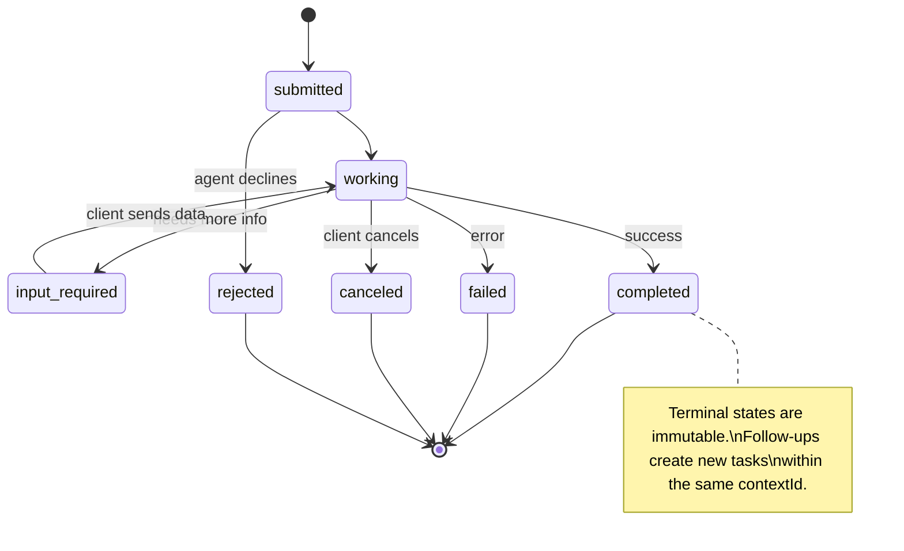

8つの状態すべて（仕様はセンチネルとして`UNSPECIFIED`も定義し、ここで省略）。

| 状態 | ターミナル? | 意味 |
|---|---|---|
| `TASK_STATE_SUBMITTED` | いいえ | 確認、未処理 |
| `TASK_STATE_WORKING` | いいえ | 積極的に処理中 |
| `TASK_STATE_INPUT_REQUIRED` | いいえ | エージェントがクライアントからもっと情報が必要 |
| `TASK_STATE_AUTH_REQUIRED` | いいえ | 認証が必要 |
| `TASK_STATE_COMPLETED` | はい | 正常に完了 |
| `TASK_STATE_FAILED` | はい | エラーで完了 |
| `TASK_STATE_CANCELED` | はい | 完了前にキャンセル |
| `TASK_STATE_REJECTED` | はい | エージェントがタスクを拒否 |

タスクがターミナル状態に達すると、それは不変である。さらなるメッセージなし。フォローアップは同じ`contextId`内で新しいタスクを作成する。

#### ワイヤ形式

A2AはJSON-RPC 2.0を使用する。実際のメッセージ交換がどのように見えるかはここ。

**クライアントはタスクを送信する:**
```json
{
  "jsonrpc": "2.0",
  "id": 1,
  "method": "SendMessage",
  "params": {
    "message": {
      "messageId": "msg-001",
      "role": "ROLE_USER",
      "parts": [{ "text": "Research React 19 compiler features" }]
    },
    "configuration": {
      "acceptedOutputModes": ["text/plain", "application/json"],
      "historyLength": 10
    }
  }
}
```

**エージェントはタスクで応答:**
```json
{
  "jsonrpc": "2.0",
  "id": 1,
  "result": {
    "task": {
      "id": "task-abc-123",
      "contextId": "ctx-xyz-789",
      "status": {
        "state": "TASK_STATE_COMPLETED",
        "timestamp": "2026-03-27T10:30:00Z"
      },
      "artifacts": [
        {
          "artifactId": "art-001",
          "name": "research-results",
          "parts": [{
            "data": {
              "findings": [
                "React 19 compiler auto-memoizes components",
                "No more manual useMemo/useCallback needed",
                "Compiler runs at build time, not runtime"
              ]
            },
            "mediaType": "application/json"
          }]
        }
      ]
    }
  }
}
```

**SSE経由でストリーミング:**
```text
POST /message:stream HTTP/1.1
Content-Type: application/json
A2A-Version: 1.0

data: {"task":{"id":"task-123","status":{"state":"TASK_STATE_WORKING"}}}

data: {"statusUpdate":{"taskId":"task-123","status":{"state":"TASK_STATE_WORKING","message":{"role":"ROLE_AGENT","parts":[{"text":"Searching documentation..."}]}}}}

data: {"artifactUpdate":{"taskId":"task-123","artifact":{"artifactId":"art-1","parts":[{"text":"partial findings..."}]},"append":true,"lastChunk":false}}

data: {"statusUpdate":{"taskId":"task-123","status":{"state":"TASK_STATE_COMPLETED"}}}
```

### ACP (Agent Communication Protocol)

**作成者:** IBM / BeeAI
**仕様バージョン:** 0.2.0 (OpenAPI 3.1.1)
**状態:** Linux Foundationの下のA2Aにマージ
**問題:** エージェントが完全な監査可能性、セッション連続性、および軌跡追跡で通信する方法は?

ACPは**エンタープライズ・プロトコル**である。多くのサマリーが請求する内容と異なり、ACPは**JSON-LDを使用していない**。OpenAPIで定義されたストレートフォワードなREST/JSON APIである。特別にするのは**TrajectoryMetadata**である。すべてのエージェント応答は、それを生成した推論ステップとツール呼び出しの詳細ログを運ぶことができる。

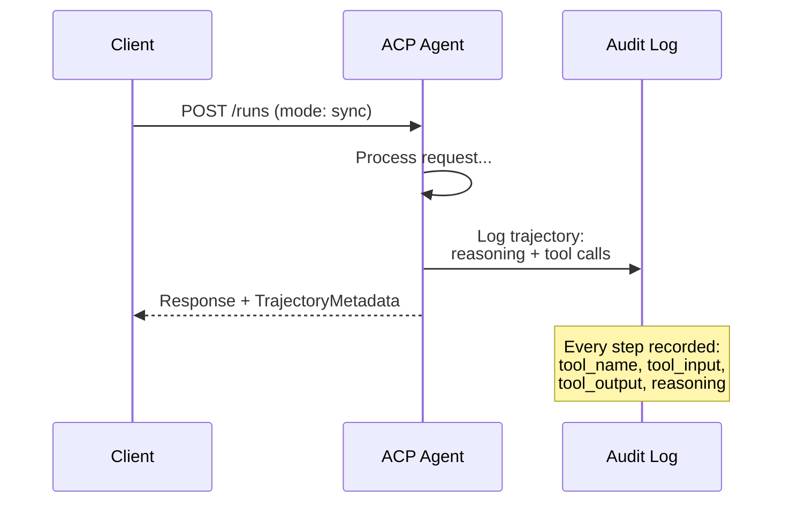

#### ACPにおけるエージェント検出

ACPは4つの検出方法を定義する。

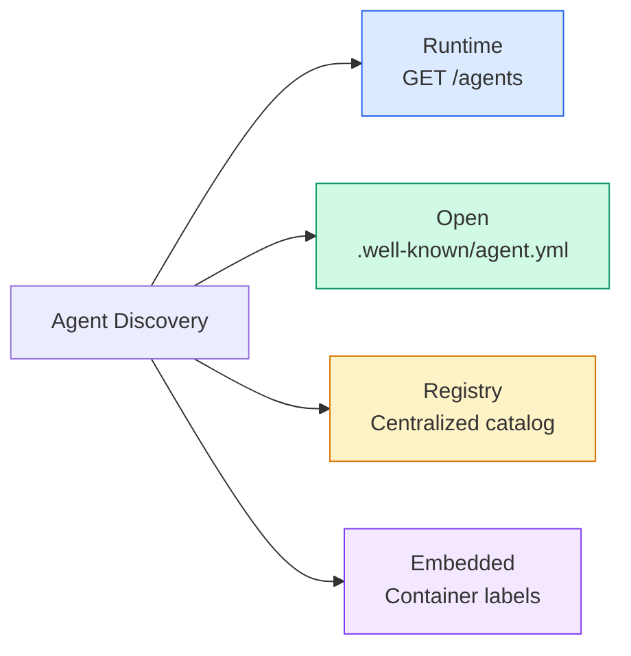

**AgentManifest**はA2Aのエージェント・カードより簡単である。

```json
{
  "name": "summarizer",
  "description": "Summarizes documents with source citations",
  "input_content_types": ["text/plain", "application/pdf"],
  "output_content_types": ["text/plain", "application/json"],
  "metadata": {
    "tags": ["summarization", "RAG"],
    "framework": "BeeAI",
    "capabilities": [
      {
        "name": "Document Summarization",
        "description": "Condenses long documents into key points"
      }
    ],
    "recommended_models": ["llama3.3:70b-instruct-fp16"],
    "license": "Apache-2.0",
    "programming_language": "Python"
  }
}
```

#### ランライフサイクル

ACPは「タスク」ではなく「ラン」を使用する。ランは3つのモードを持つエージェント実行である。

| モード | 動作 |
|---|---|
| `sync` | ブロッキング。応答には完全な結果が含まれる。 |
| `async` | 202をすぐに返す。ステータスについて `GET /runs/{id}` をポーリングする。 |
| `stream` | SSEストリーム。エージェントが機能するときにイベントが起動する。 |

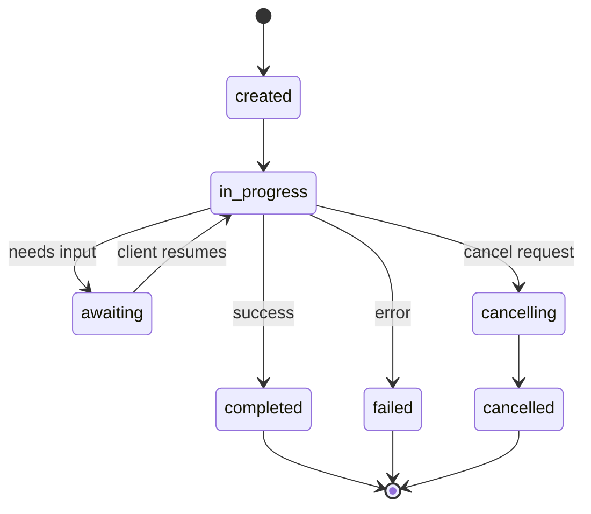

#### TrajectoryMetadata (監査証跡)

これはACPの重要な差別化要因である。すべてのメッセージ部分は、エージェントが正確に何をしたかを示すメタデータを含むことができる。

```json
{
  "role": "agent/researcher",
  "parts": [
    {
      "content_type": "text/plain",
      "content": "The weather in San Francisco is 72F and sunny.",
      "metadata": {
        "kind": "trajectory",
        "message": "I need to check the weather for this location",
        "tool_name": "weather_api",
        "tool_input": { "location": "San Francisco, CA" },
        "tool_output": { "temperature": 72, "condition": "sunny" }
      }
    }
  ]
}
```

規制業界ではこれは金だ。すべての回答は証明可能な推論の連鎖に付属している。どのツールが呼ばれた、どんな入力が使用された、どんな出力が受け取られた。ブラックボックスなし。

ACPは**CitationMetadata**もサポートしている。ソース属性の場合。

```json
{
  "kind": "citation",
  "start_index": 0,
  "end_index": 47,
  "url": "https://weather.gov/sf",
  "title": "NWS San Francisco Forecast"
}
```

### ANP (Agent Network Protocol)

**作成者:** オープンソース・コミュニティ（GaoWei Changによって設立）
**レポ:** [github.com/agent-network-protocol/AgentNetworkProtocol](https://github.com/agent-network-protocol/AgentNetworkProtocol)
**問題:** 異なる組織のエージェントが中央当局なしで互いに信頼する方法は?

ANPは**分散型アイデンティティ・プロトコル**である。W3C Decentralized Identifiers（DIDs）とエンドツーエンド暗号化を使用して信頼を構築する。A2Aで既知のエンドポイントを通じてエージェントを検出する場合、ANPはエージェントが暗号的にアイデンティティを証明することができる。

ANPは3つのレイヤーを持っている。

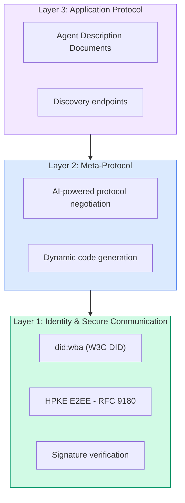

#### DIDドキュメント（実際の構造）

ANPは`did:wba`（Web-Based Agent）と呼ばれるカスタムDIDメソッドを使用する。DID `did:wba:example.com:user:alice` は `https://example.com/user/alice/did.json` に解決される。

```json
{
  "@context": [
    "https://www.w3.org/ns/did/v1",
    "https://w3id.org/security/suites/jws-2020/v1",
    "https://w3id.org/security/suites/secp256k1-2019/v1"
  ],
  "id": "did:wba:example.com:user:alice",
  "verificationMethod": [
    {
      "id": "did:wba:example.com:user:alice#key-1",
      "type": "EcdsaSecp256k1VerificationKey2019",
      "controller": "did:wba:example.com:user:alice",
      "publicKeyJwk": {
        "crv": "secp256k1",
        "x": "NtngWpJUr-rlNNbs0u-Aa8e16OwSJu6UiFf0Rdo1oJ4",
        "y": "qN1jKupJlFsPFc1UkWinqljv4YE0mq_Ickwnjgasvmo",
        "kty": "EC"
      }
    },
    {
      "id": "did:wba:example.com:user:alice#key-x25519-1",
      "type": "X25519KeyAgreementKey2019",
      "controller": "did:wba:example.com:user:alice",
      "publicKeyMultibase": "z9hFgmPVfmBZwRvFEyniQDBkz9LmV7gDEqytWyGZLmDXE"
    }
  ],
  "authentication": [
    "did:wba:example.com:user:alice#key-1"
  ],
  "keyAgreement": [
    "did:wba:example.com:user:alice#key-x25519-1"
  ],
  "humanAuthorization": [
    "did:wba:example.com:user:alice#key-1"
  ],
  "service": [
    {
      "id": "did:wba:example.com:user:alice#agent-description",
      "type": "AgentDescription",
      "serviceEndpoint": "https://example.com/agents/alice/ad.json"
    }
  ]
}
```

注目することの重要なことら。

- **キー分離**が適用される。署名キー（secp256k1）は暗号化キー（X25519）から分離されている。
- **`humanAuthorization`**はANPに固有である。これらのキーは使用前に明示的な人間の承認（生体認証、パスワード、HSM）が必要である。資金移動のような高リスク操作はこのパスを通過する。
- **`keyAgreement`**キーはHPKEエンドツーエンド暗号化（RFC 9180）に使用される。
- **サービス**セクションはエージェント・ディスクリプション・ドキュメントにリンクする。

#### ANPで信頼がどのように機能するか

ANPは**ウェブ・オブ・トラストまたは推奨グラフを使用しない**。信頼は二国間であり、相互作用ごとに検証される。

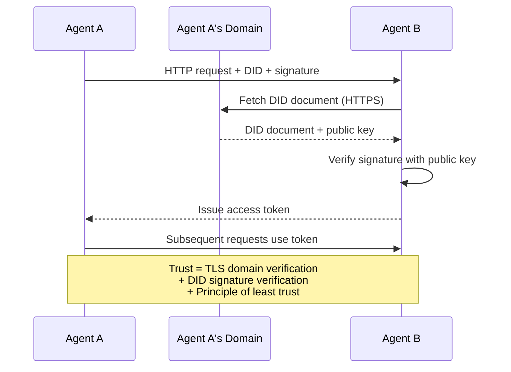

信頼は3つのソースから来ている。

1. **ドメインレベルTLS**はDIDドキュメントホストを検証する
2. **DID暗号署名**はエージェントのアイデンティティを検証する
3. **最小信頼の原則**は最小権限のみを付与する

ゴシップベースの信頼伝播やPageRankスコアリングはない。DIDを通じて各エージェントを直接検証する。

#### メタプロトコル交渉

これはANPの最も新しい機能である。異なるエコシステムから2つのエージェントが出会うとき、彼らは事前合意したデータ形式が必要ではない。彼らは自然言語で交渉する。

```json
{
  "action": "protocolNegotiation",
  "sequenceId": 0,
  "candidateProtocols": "I can communicate using:\n1. JSON-RPC with hotel booking schema\n2. REST with OpenAPI 3.1 spec\n3. Natural language over HTTP",
  "modificationSummary": "Initial proposal",
  "status": "negotiating"
}
```

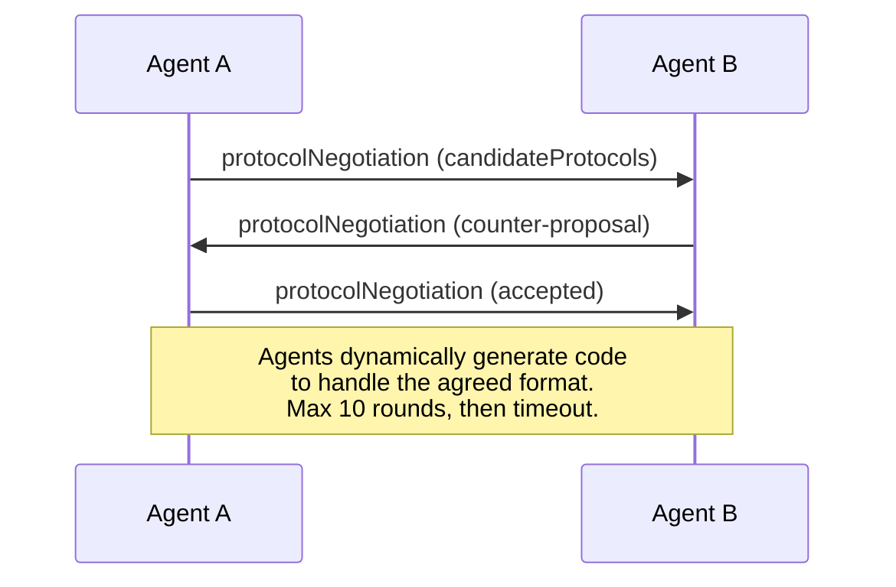

エージェントは形式に同意するまで（最大10ラウンド）行き来し、それからそれを処理するコードを動的に生成する。ステータス値。`negotiating`、`rejected`、`accepted`、`timeout`。

これは、これまで見たことのない2つのエージェントが、誰かが共有スキーマを事前定義することなく、通信方法を理解できることを意味する。

### 比較（修正）

| | MCP | A2A | ACP | ANP |
|---|---|---|---|---|
| **作成者** | Anthropic | Google / Linux Foundation | IBM / BeeAI | コミュニティ |
| **仕様形式** | JSON-RPC | JSON-RPC / REST / gRPC | OpenAPI 3.1 (REST) | JSON-RPC |
| **主要用途** | エージェント間ツール | エージェント間 | エージェント間 | エージェント間 |
| **検出** | ツール・リスティング | `/.well-known/agent-card.json` | `GET /agents`, `/.well-known/agent.yml` | `/.well-known/agent-descriptions`, DIDサービス・エンドポイント |
| **アイデンティティ** | 暗黙的（ローカル） | セキュリティスキーム（OAuth、mTLS） | サーバーレベル | W3C DID (`did:wba`) with E2EE |
| **監査証跡** | N/A | 基本（タスク履歴） | TrajectoryMetadata（ツール呼び出し、推論） | 正式に指定されていない |
| **状態機械** | N/A | 9タスク状態 | 7ラン状態 | N/A |
| **ストリーミング** | N/A | SSE | SSE | トランスポート非依存 |
| **ユニークな機能** | ツール・スキーマ | エージェント・カード+スキル | 軌跡監査証跡 | メタプロトコル交渉 |
| **最良用途** | ツール&データ | 動的協力 | 規制業界 | クロスオルグ信頼 |
| **状態** | 安定 | 安定（v1.0） | A2Aへマージ | 積極的開発 |

### それらがどのように機能するか

これらのプロトコルは相互に排他的ではない。現実的なエンタープライズ・システムは複数を使用する。

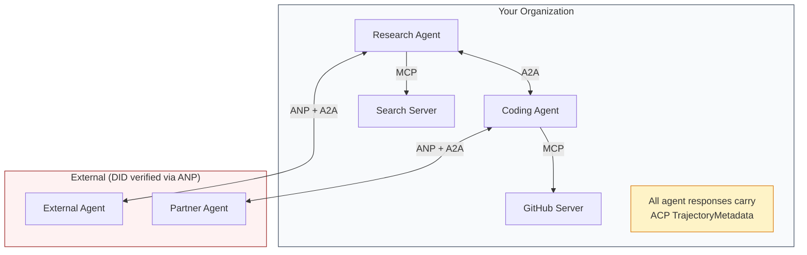

- **MCP**は各エージェントをそのツールに接続する
- **A2A**はエージェント間の協力（内部および外部）を処理する
- **ACP**は監査可能性のため応答を軌跡メタデータで包む
- **ANP**は制御されていないエージェントのためのアイデンティティ検証を提供する

## 作成する

### ステップ1。コア・メッセージ・タイプ

すべてのマルチエージェント・システムはメッセージ形式で始まる。実際のプロトコルが使用するものにマップするタイプを定義する。

```typescript
import crypto from "node:crypto";

type MessageRole = "user" | "agent";

type MessagePart =
  | { kind: "text"; text: string }
  | { kind: "data"; data: unknown; mediaType: string }
  | { kind: "file"; name: string; url: string; mediaType: string };

type TrajectoryEntry = {
  reasoning: string;
  toolName?: string;
  toolInput?: unknown;
  toolOutput?: unknown;
  timestamp: number;
};

type AgentMessage = {
  id: string;
  role: MessageRole;
  parts: MessagePart[];
  trajectory?: TrajectoryEntry[];
  replyTo?: string;
  timestamp: number;
};

function createMessage(
  role: MessageRole,
  parts: MessagePart[],
  replyTo?: string
): AgentMessage {
  return {
    id: crypto.randomUUID(),
    role,
    parts,
    replyTo,
    timestamp: Date.now(),
  };
}

function textMessage(role: MessageRole, text: string): AgentMessage {
  return createMessage(role, [{ kind: "text", text }]);
}
```

注目。`MessagePart`はマルチモーダル（テキスト、構造化データ、ファイル）実際のA2AおよびACP仕様のように。`TrajectoryEntry`は推論チェーンをキャプチャし、ACPのTrajectoryMetadataに一致する。

### ステップ2。A2Aエージェント・カードとレジストリ

実際のA2A仕様に一致するエージェント検出を構築する。

```typescript
type Skill = {
  id: string;
  name: string;
  description: string;
  tags: string[];
  inputModes: string[];
  outputModes: string[];
};

type AgentCard = {
  name: string;
  description: string;
  version: string;
  url: string;
  capabilities: {
    streaming: boolean;
    pushNotifications: boolean;
  };
  defaultInputModes: string[];
  defaultOutputModes: string[];
  skills: Skill[];
};

class AgentRegistry {
  private cards: Map<string, AgentCard> = new Map();

  register(card: AgentCard) {
    this.cards.set(card.name, card);
  }

  discoverBySkillTag(tag: string): AgentCard[] {
    return [...this.cards.values()].filter((card) =>
      card.skills.some((skill) => skill.tags.includes(tag))
    );
  }

  discoverByInputMode(mimeType: string): AgentCard[] {
    return [...this.cards.values()].filter(
      (card) =>
        card.defaultInputModes.includes(mimeType) ||
        card.skills.some((skill) => skill.inputModes.includes(mimeType))
    );
  }

  resolve(name: string): AgentCard | undefined {
    return this.cards.get(name);
  }

  listAll(): AgentCard[] {
    return [...this.cards.values()];
  }
}
```

これは単純な名前とカパビリティマップより大幅に豊かである。スキル・タグ、入力MIMEタイプ、または名前でエージェントを検出でき、実際のA2A仕様がサポートしているとおり。

### ステップ3。A2Aタスク・ライフサイクル

完全なタスク状態マシンを構築する。

```typescript
type TaskState =
  | "submitted"
  | "working"
  | "input-required"
  | "auth-required"
  | "completed"
  | "failed"
  | "canceled"
  | "rejected";

const TERMINAL_STATES: TaskState[] = [
  "completed",
  "failed",
  "canceled",
  "rejected",
];

type TaskStatus = {
  state: TaskState;
  message?: AgentMessage;
  timestamp: number;
};

type Artifact = {
  id: string;
  name: string;
  parts: MessagePart[];
};

type Task = {
  id: string;
  contextId: string;
  status: TaskStatus;
  artifacts: Artifact[];
  history: AgentMessage[];
};

type TaskEvent =
  | { kind: "statusUpdate"; taskId: string; status: TaskStatus }
  | {
      kind: "artifactUpdate";
      taskId: string;
      artifact: Artifact;
      append: boolean;
      lastChunk: boolean;
    };

type TaskHandler = (
  task: Task,
  message: AgentMessage
) => AsyncGenerator<TaskEvent>;

class TaskManager {
  private tasks: Map<string, Task> = new Map();
  private handlers: Map<string, TaskHandler> = new Map();
  private listeners: Map<string, ((event: TaskEvent) => void)[]> = new Map();

  registerHandler(agentName: string, handler: TaskHandler) {
    this.handlers.set(agentName, handler);
  }

  subscribe(taskId: string, listener: (event: TaskEvent) => void) {
    const existing = this.listeners.get(taskId) ?? [];
    existing.push(listener);
    this.listeners.set(taskId, existing);
  }

  async sendMessage(
    agentName: string,
    message: AgentMessage,
    contextId?: string
  ): Promise<Task> {
    const handler = this.handlers.get(agentName);
    if (!handler) {
      const task = this.createTask(contextId);
      task.status = {
        state: "rejected",
        timestamp: Date.now(),
        message: textMessage("agent", `No handler for ${agentName}`),
      };
      return task;
    }

    const task = this.createTask(contextId);
    task.history.push(message);
    task.status = { state: "submitted", timestamp: Date.now() };

    this.processTask(task, handler, message).catch((err) => {
      task.status = {
        state: "failed",
        timestamp: Date.now(),
        message: textMessage("agent", String(err)),
      };
    });
    return task;
  }

  getTask(taskId: string): Task | undefined {
    return this.tasks.get(taskId);
  }

  cancelTask(taskId: string): boolean {
    const task = this.tasks.get(taskId);
    if (!task || TERMINAL_STATES.includes(task.status.state)) return false;
    task.status = { state: "canceled", timestamp: Date.now() };
    this.emit(taskId, {
      kind: "statusUpdate",
      taskId,
      status: task.status,
    });
    return true;
  }

  private createTask(contextId?: string): Task {
    const task: Task = {
      id: crypto.randomUUID(),
      contextId: contextId ?? crypto.randomUUID(),
      status: { state: "submitted", timestamp: Date.now() },
      artifacts: [],
      history: [],
    };
    this.tasks.set(task.id, task);
    return task;
  }

  private async processTask(
    task: Task,
    handler: TaskHandler,
    message: AgentMessage
  ) {
    task.status = { state: "working", timestamp: Date.now() };
    this.emit(task.id, {
      kind: "statusUpdate",
      taskId: task.id,
      status: task.status,
    });

    try {
      for await (const event of handler(task, message)) {
        if (TERMINAL_STATES.includes(task.status.state)) break;

        if (event.kind === "statusUpdate") {
          task.status = event.status;
        }
        if (event.kind === "artifactUpdate") {
          const existing = task.artifacts.find(
            (a) => a.id === event.artifact.id
          );
          if (existing && event.append) {
            existing.parts.push(...event.artifact.parts);
          } else {
            task.artifacts.push(event.artifact);
          }
        }
        this.emit(task.id, event);
      }
    } catch (err) {
      task.status = {
        state: "failed",
        timestamp: Date.now(),
        message: textMessage("agent", String(err)),
      };
      this.emit(task.id, {
        kind: "statusUpdate",
        taskId: task.id,
        status: task.status,
      });
    }
  }

  private emit(taskId: string, event: TaskEvent) {
    for (const listener of this.listeners.get(taskId) ?? []) {
      listener(event);
    }
  }
}
```

これは実際のA2Aタスク・ライフサイクルを実装する。提出、作業、入力必須、ターミナル状態。ハンドラーはSSEストリーミング・モデルに一致するイベント（ステータス更新とアーティファクト・チャンク）を生成する非同期ジェネレータである。

### ステップ4。ACPスタイル監査証跡

軌跡追跡を使用した通信をラップする。

```typescript
type AuditEntry = {
  runId: string;
  agentName: string;
  input: AgentMessage[];
  output: AgentMessage[];
  trajectory: TrajectoryEntry[];
  status: "created" | "in-progress" | "completed" | "failed" | "awaiting";
  startedAt: number;
  completedAt?: number;
  sessionId?: string;
};

class AuditableRunner {
  private log: AuditEntry[] = [];
  private handlers: Map<
    string,
    (input: AgentMessage[]) => Promise<{
      output: AgentMessage[];
      trajectory: TrajectoryEntry[];
    }>
  > = new Map();

  registerAgent(
    name: string,
    handler: (input: AgentMessage[]) => Promise<{
      output: AgentMessage[];
      trajectory: TrajectoryEntry[];
    }>
  ) {
    this.handlers.set(name, handler);
  }

  async run(
    agentName: string,
    input: AgentMessage[],
    sessionId?: string
  ): Promise<AuditEntry> {
    const entry: AuditEntry = {
      runId: crypto.randomUUID(),
      agentName,
      input: structuredClone(input),
      output: [],
      trajectory: [],
      status: "created",
      startedAt: Date.now(),
      sessionId,
    };
    this.log.push(entry);

    const handler = this.handlers.get(agentName);
    if (!handler) {
      entry.status = "failed";
      return entry;
    }

    entry.status = "in-progress";
    try {
      const result = await handler(input);
      entry.output = structuredClone(result.output);
      entry.trajectory = structuredClone(result.trajectory);
      entry.status = "completed";
      entry.completedAt = Date.now();
    } catch (err) {
      entry.status = "failed";
      entry.trajectory.push({
        reasoning: `Error: ${String(err)}`,
        timestamp: Date.now(),
      });
      entry.completedAt = Date.now();
    }
    return entry;
  }

  getFullAuditLog(): AuditEntry[] {
    return structuredClone(this.log);
  }

  getAuditLogForAgent(agentName: string): AuditEntry[] {
    return structuredClone(
      this.log.filter((e) => e.agentName === agentName)
    );
  }

  getAuditLogForSession(sessionId: string): AuditEntry[] {
    return structuredClone(
      this.log.filter((e) => e.sessionId === sessionId)
    );
  }

  getTrajectoryForRun(runId: string): TrajectoryEntry[] {
    const entry = this.log.find((e) => e.runId === runId);
    return entry ? structuredClone(entry.trajectory) : [];
  }
}
```

すべてのエージェント実行は完全な監査エントリを生成する。何が入ったか、何が出たか、その間のツール呼び出しと推論ステップの完全な軌跡。エージェント、セッション、または個別ラン別にクエリを実行できる。

### ステップ5。ANPスタイル・アイデンティティ検証

DIDベースのアイデンティティと検証を構築する。

```typescript
type VerificationMethod = {
  id: string;
  type: string;
  controller: string;
  publicKeyDer: string;
};

type DIDDocument = {
  id: string;
  verificationMethod: VerificationMethod[];
  authentication: string[];
  keyAgreement: string[];
  humanAuthorization: string[];
  service: { id: string; type: string; serviceEndpoint: string }[];
};

type AgentIdentity = {
  did: string;
  document: DIDDocument;
  privateKey: crypto.KeyObject;
  publicKey: crypto.KeyObject;
};

class IdentityRegistry {
  private documents: Map<string, DIDDocument> = new Map();

  publish(doc: DIDDocument) {
    this.documents.set(doc.id, doc);
  }

  resolve(did: string): DIDDocument | undefined {
    return this.documents.get(did);
  }

  verify(did: string, signature: string, payload: string): boolean {
    const doc = this.documents.get(did);
    if (!doc) return false;

    const authKeyIds = doc.authentication;
    const authKeys = doc.verificationMethod.filter((vm) =>
      authKeyIds.includes(vm.id)
    );

    for (const key of authKeys) {
      const publicKey = crypto.createPublicKey({
        key: Buffer.from(key.publicKeyDer, "base64"),
        format: "der",
        type: "spki",
      });
      const isValid = crypto.verify(
        null,
        Buffer.from(payload),
        publicKey,
        Buffer.from(signature, "hex")
      );
      if (isValid) return true;
    }
    return false;
  }

  requiresHumanAuth(did: string, operationKeyId: string): boolean {
    const doc = this.documents.get(did);
    if (!doc) return false;
    return doc.humanAuthorization.includes(operationKeyId);
  }
}

function createIdentity(domain: string, agentName: string): AgentIdentity {
  const did = `did:wba:${domain}:agent:${agentName}`;
  const { publicKey, privateKey } = crypto.generateKeyPairSync("ed25519");

  const publicKeyDer = publicKey
    .export({ format: "der", type: "spki" })
    .toString("base64");

  const keyId = `${did}#key-1`;
  const encKeyId = `${did}#key-x25519-1`;

  const document: DIDDocument = {
    id: did,
    verificationMethod: [
      {
        id: keyId,
        type: "Ed25519VerificationKey2020",
        controller: did,
        publicKeyDer,
      },
      {
        id: encKeyId,
        type: "X25519KeyAgreementKey2019",
        controller: did,
        publicKeyDer,
      },
    ],
    authentication: [keyId],
    keyAgreement: [encKeyId],
    humanAuthorization: [],
    service: [
      {
        id: `${did}#agent-description`,
        type: "AgentDescription",
        serviceEndpoint: `https://${domain}/agents/${agentName}/ad.json`,
      },
    ],
  };

  return { did, document, privateKey, publicKey };
}

function signPayload(identity: AgentIdentity, payload: string): string {
  return crypto
    .sign(null, Buffer.from(payload), identity.privateKey)
    .toString("hex");
}
```

これは実際のANPアイデンティティ・モデルを反映している。エージェントはDIDドキュメントを持つ別の認証、キー合意、人間の承認キーを持つ。`IdentityRegistry`はDID解決をシミュレートする（本番では、これはエージェントのドメインへのHTTPフェッチになる）。

### ステップ6。プロトコル・ゲートウェイ

4つのプロトコルをすべて統一システムに接続する。

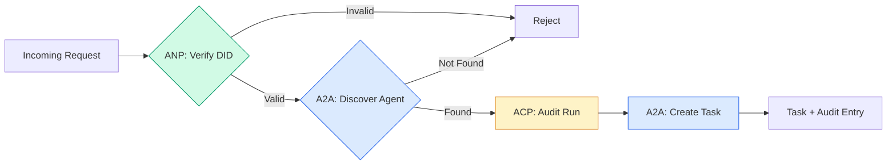

```typescript
class ProtocolGateway {
  private registry: AgentRegistry;
  private taskManager: TaskManager;
  private auditRunner: AuditableRunner;
  private identityRegistry: IdentityRegistry;

  constructor(
    registry: AgentRegistry,
    taskManager: TaskManager,
    auditRunner: AuditableRunner,
    identityRegistry: IdentityRegistry
  ) {
    this.registry = registry;
    this.taskManager = taskManager;
    this.auditRunner = auditRunner;
    this.identityRegistry = identityRegistry;
  }

  async delegateTask(
    fromDid: string,
    signature: string,
    targetAgent: string,
    message: AgentMessage,
    sessionId?: string
  ): Promise<{ task: Task; audit: AuditEntry } | { error: string }> {
    if (!this.identityRegistry.verify(fromDid, signature, message.id)) {
      return { error: "Identity verification failed" };
    }

    const card = this.registry.resolve(targetAgent);
    if (!card) {
      return { error: `Agent ${targetAgent} not found in registry` };
    }

    const audit = await this.auditRunner.run(
      targetAgent,
      [message],
      sessionId
    );
    const task = await this.taskManager.sendMessage(targetAgent, message);

    return { task, audit };
  }

  discoverAndDelegate(
    fromDid: string,
    signature: string,
    skillTag: string,
    message: AgentMessage
  ): Promise<{ task: Task; audit: AuditEntry } | { error: string }> {
    const candidates = this.registry.discoverBySkillTag(skillTag);
    if (candidates.length === 0) {
      return Promise.resolve({
        error: `No agents found with skill tag: ${skillTag}`,
      });
    }
    return this.delegateTask(
      fromDid,
      signature,
      candidates[0].name,
      message
    );
  }
}
```

ゲートウェイは1つの呼び出しで4つのことを行う。

1. **ANP**。DID署名経由で呼び出し元のアイデンティティを検証する
2. **A2A**。ターゲット・エージェントを検出し、カパビリティをチェックする
3. **ACP**。実行を軌跡を持つ監査証跡でラップする
4. **A2A**。完全なライフサイクル追跡を使用してタスクを作成する

### ステップ7。すべてを接続する

```typescript
async function protocolDemo() {
  const registry = new AgentRegistry();
  registry.register({
    name: "researcher",
    description: "Searches and summarizes findings",
    version: "1.0.0",
    url: "https://researcher.local/a2a/v1",
    capabilities: { streaming: true, pushNotifications: false },
    defaultInputModes: ["text/plain"],
    defaultOutputModes: ["text/plain", "application/json"],
    skills: [
      {
        id: "web-research",
        name: "Web Research",
        description: "Searches the web",
        tags: ["research", "search", "summarization"],
        inputModes: ["text/plain"],
        outputModes: ["application/json"],
      },
    ],
  });
  registry.register({
    name: "coder",
    description: "Writes code from specs",
    version: "1.0.0",
    url: "https://coder.local/a2a/v1",
    capabilities: { streaming: false, pushNotifications: false },
    defaultInputModes: ["text/plain", "application/json"],
    defaultOutputModes: ["text/plain"],
    skills: [
      {
        id: "code-gen",
        name: "Code Generation",
        description: "Generates code",
        tags: ["coding", "generation"],
        inputModes: ["text/plain", "application/json"],
        outputModes: ["text/plain"],
      },
    ],
  });

  const taskManager = new TaskManager();
  const auditRunner = new AuditableRunner();

  const researchTrajectory: TrajectoryEntry[] = [];

  taskManager.registerHandler(
    "researcher",
    async function* (task, message) {
      yield {
        kind: "statusUpdate" as const,
        taskId: task.id,
        status: { state: "working" as const, timestamp: Date.now() },
      };

      researchTrajectory.push({
        reasoning: "Searching for React 19 documentation",
        toolName: "web_search",
        toolInput: { query: "React 19 compiler features" },
        toolOutput: {
          results: ["react.dev/blog/react-19", "github.com/react/react"],
        },
        timestamp: Date.now(),
      });

      researchTrajectory.push({
        reasoning: "Extracting key findings from search results",
        toolName: "doc_analysis",
        toolInput: { url: "react.dev/blog/react-19" },
        toolOutput: {
          summary:
            "React 19 compiler auto-memoizes, no manual useMemo needed",
        },
        timestamp: Date.now(),
      });

      yield {
        kind: "artifactUpdate" as const,
        taskId: task.id,
        artifact: {
          id: crypto.randomUUID(),
          name: "research-results",
          parts: [
            {
              kind: "data" as const,
              data: {
                findings: [
                  "React 19 compiler auto-memoizes components",
                  "No more manual useMemo/useCallback needed",
                  "Compiler runs at build time, not runtime",
                ],
                sources: ["react.dev/blog/react-19"],
              },
              mediaType: "application/json",
            },
          ],
        },
        append: false,
        lastChunk: true,
      };

      yield {
        kind: "statusUpdate" as const,
        taskId: task.id,
        status: { state: "completed" as const, timestamp: Date.now() },
      };
    }
  );

  auditRunner.registerAgent("researcher", async () => ({
    output: [
      textMessage("agent", "React 19 compiler auto-memoizes components"),
    ],
    trajectory: researchTrajectory,
  }));

  const identityRegistry = new IdentityRegistry();

  const coderIdentity = createIdentity("coder.local", "coder");
  const researcherIdentity = createIdentity("researcher.local", "researcher");

  identityRegistry.publish(coderIdentity.document);
  identityRegistry.publish(researcherIdentity.document);

  const gateway = new ProtocolGateway(
    registry,
    taskManager,
    auditRunner,
    identityRegistry
  );

  console.log("=== Protocol Demo ===\n");

  console.log("1. Agent Discovery (A2A)");
  const researchAgents = registry.discoverBySkillTag("research");
  console.log(
    `   Found ${researchAgents.length} agent(s):`,
    researchAgents.map((a) => a.name)
  );

  console.log("\n2. Identity Verification (ANP)");
  const message = textMessage("user", "Research React 19 compiler features");
  const signature = signPayload(coderIdentity, message.id);
  const verified = identityRegistry.verify(
    coderIdentity.did,
    signature,
    message.id
  );
  console.log(`   Coder DID: ${coderIdentity.did}`);
  console.log(`   Signature verified: ${verified}`);

  console.log("\n3. Task Delegation (A2A + ACP + ANP)");
  const result = await gateway.delegateTask(
    coderIdentity.did,
    signature,
    "researcher",
    message,
    "session-001"
  );

  if ("error" in result) {
    console.log(`   Error: ${result.error}`);
    return;
  }

  console.log(`   Task ID: ${result.task.id}`);
  console.log(`   Task state: ${result.task.status.state}`);
  console.log(`   Artifacts: ${result.task.artifacts.length}`);

  console.log("\n4. Audit Trail (ACP)");
  console.log(`   Run ID: ${result.audit.runId}`);
  console.log(`   Status: ${result.audit.status}`);
  console.log(`   Trajectory steps: ${result.audit.trajectory.length}`);
  for (const step of result.audit.trajectory) {
    console.log(`     - ${step.reasoning}`);
    if (step.toolName) {
      console.log(`       Tool: ${step.toolName}`);
    }
  }

  console.log("\n5. Full Audit Log");
  const fullLog = auditRunner.getFullAuditLog();
  console.log(`   Total runs: ${fullLog.length}`);
  for (const entry of fullLog) {
    const duration = entry.completedAt
      ? `${entry.completedAt - entry.startedAt}ms`
      : "in-progress";
    console.log(`   ${entry.agentName}: ${entry.status} (${duration})`);
  }
}

protocolDemo().catch((err) => {
  console.error("Protocol demo failed:", err);
  process.exitCode = 1;
});
```

## 何が悪くなるか

プロトコルは幸せなパスを解決する。本番で何が壊れるかはここ。

**スキーマドリフト。** エージェントAは`application/json`出力を宣伝するエージェント・カードを発行する。しかし、JSONスキーマはバージョン間で変わる。エージェント・Bは古い形式を解析し、ゴミを取得する。フィックス。スキルと出力スキーマをバージョン化する。A2A仕様はこの理由でエージェント・カード上の`version`をサポートする。

**状態機械違反。** エージェント・ハンドラーが`completed`イベントを生成してから、より多くのアーティファクトを生成しようとする。タスクは不変である。コードは静かに更新を落とすか、またはスロー。フィックス。ターミナル状態の前にチェックする。上記の`TaskManager`はターミナル状態の後の`break`でこれを強制する。

**信頼解決の失敗。** エージェント・Aはエージェント・Bの DID を検証しようとしますが、エージェント・B のドメインはダウンしています。DIDドキュメントはフェッチできません。フェイルオープン（未検証エージェントを受け入れる）またはフェイルクローズド（すべてを拒否）を失敗しますか? ANPは最小信頼の原則でフェイルクローズドを推奨する。

**軌跡肥大化。** ACP軌跡ログは強力だが費用がかかる。200のツール呼び出しを行う複雑なエージェントは、実行あたり大量の監査エントリを生成する。フィックス。設定可能な詳細度で軌跡をログに記録する。コンプライアンスのためツール名と IO をログに記録し、規制されていないワークロードの理由ステップをスキップする。

**発見の雷群。** 50のエージェントが起動時に`GET /agents`を同時にクエリします。フィックス。TTLでエージェント・カードをキャッシュし、検出間隔をずらし、またはポーリング代わりにプッシュベースの登録を使用する。

## 使用する

### 実装

**A2A**は最も成熟している。Googleの[公式仕様](https://github.com/google/A2A)はLinux Foundationの下でオープンソースである。PythonとTypeScript用SDK。エージェントが動的検出と協力を必要とする場合は、ここから始める。

**ACP**はA2Aにマージされている。IBMの[BeeAIプロジェクト](https://github.com/i-am-bee/acp)はA2A代替としてACPを作成したが、軌跡メタデータの概念はA2Aエコシステムに吸収されている。A2Aをトランスポートとして使用する場合でも、ACPパターン（軌跡ログ、ラン・ライフサイクル）を使用する。

**ANP**は最も実験的である。[コミュニティレポ](https://github.com/agent-network-protocol/AgentNetworkProtocol)にはPython SDK（AgentConnect）がある。メタプロトコル交渉の概念は本当に新しい。クロス組織エージェント展開のために見張るに値する。

**MCP**はPhase 13で既にカバーされている。エージェントがツールを使用したい場合、MCPは標準である。

### 正しいプロトコル選択

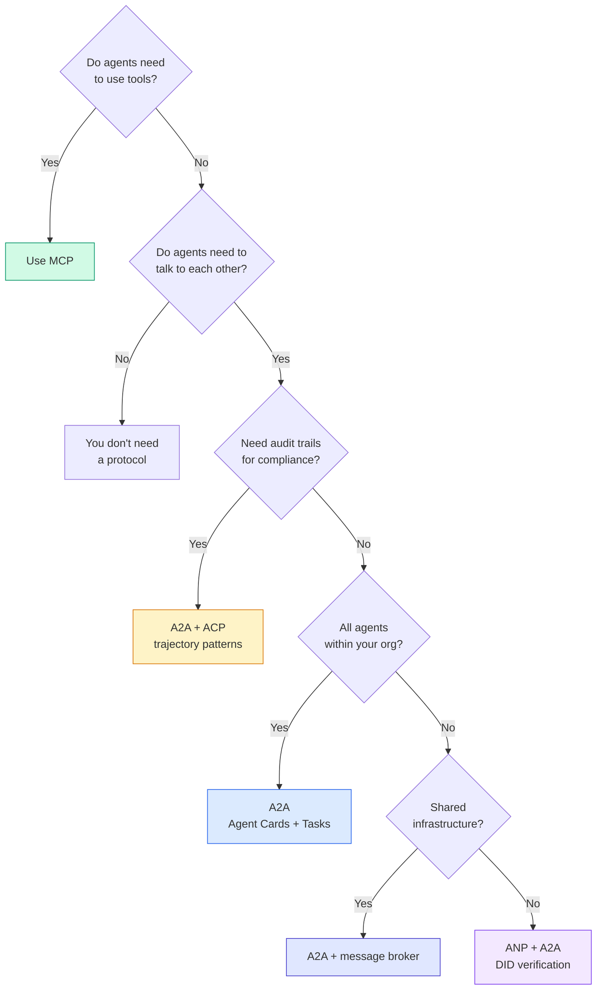

## 出荷する

このレッスンはこれを生成する。

- `code/main.ts` — 4つすべてのプロトコルパターンの完全な実装
- `outputs/prompt-protocol-selector.md` — システムのプロトコル選択を支援するプロンプト

## 演習

1. **マルチホップ・タスク委任。** `TaskManager`を拡張してエージェント・ハンドラーがサブタスクを他のエージェントに委任できるようにする。研究者がタスクを受け取り、「検索」と「要約」サブタスクを2つの専門家エージェントに委任し、両方の完了を待ってから、その結果をそれ自身のアーティファクトにマージする。

2. **ストリーミング監査証跡。** `AuditableRunner`を修正してストリーミング・モードをサポートする。完全な結果を待つのではなく、軌跡エントリが追加されるときにリアルタイムで`AuditEntry`更新を生成する。監査スナップショットを生成する非同期ジェネレータを使用する。

3. **DID回転。** `IdentityRegistry`にキー回転を追加する。エージェントは`previousDid`参照を保持しながら更新されたキーを持つ新しいDIDドキュメントを発行できるべきである。検証者は猶予期間中に現在と以前のキーの両方の署名を受け入れるべき。

4. **プロトコル交渉。** ANPのメタプロトコル概念を実装する。2つのエージェントが候補形式（例えば「I can speak JSON-RPC」vs「I prefer REST」）で`protocolNegotiation`メッセージを交換する。最大3ラウンド後、形式に同意するかタイムアウトする。合意された形式は使用する`TaskManager`または`AuditableRunner`を決定する。

5. **レート制限付き検出。** 設定可能なTTLとエージェント単位のレート制限付き検出クエリを持つ`RateLimitedRegistry`ラッパーを追加する。起動時に100のエージェントの雷群をシミュレートし、差を測定する。

## キーターム

| ターム | 人々が言うこと | 実際には何を意味するか |
|------|----------------|------------------------|
| MCP | 「AIツール用のプロトコル」 | エージェントがツールを検出して使用するクライアント・サーバー・プロトコル。エージェント間ツール、エージェント間ではない。 |
| A2A | 「Googleのエージェント・プロトコル」 | Linux Foundationの下のエージェント協力用ピアツーピア・プロトコル。エージェント・カード経由の検出、9状態タスク・ライフサイクル、SSE経由のストリーミング。JSON-RPC、REST、gRPCバインディングをサポート。 |
| ACP | 「エンタープライズ・エージェント・メッセージング」 | TrajectoryMetadataを持つエージェント実行用IBM/BeeAIのREST API。すべての応答は推論とツール呼び出しの完全なチェーンを運ぶ。A2Aにマージ中。 |
| ANP | 「分散型エージェント・アイデンティティ」 | 暗号学的アイデンティティ用`did:wba`（DID）、E2EE用HPKE、見たことのないエージェント間の AI 駆動メタプロトコル交渉を使用するコミュニティ・プロトコル。 |
| エージェント・カード | 「エージェントの名刺」 | `/.well-known/agent-card.json`のJSONドキュメントでスキル、サポートされるMIMEタイプ、セキュリティスキーム、プロトコル・バインディングを説明する。 |
| DID | 「分散ID」 | エージェント自身のドメインでホストされた暗号的に検証可能なアイデンティティ用W3C標準。ANPは`did:wba`メソッドを使用する。 |
| TrajectoryMetadata | 「監査レシート」 | すべてのエージェント応答に推論ステップ、ツール呼び出し、それらの入出力を添付するACPのメカニズム。 |
| メタプロトコル | 「エージェントが話す方法を交渉する」 | ANPのアプローチ、エージェントは自然言語を使用してデータ形式に動的に同意してからそれを処理するコードを生成する。 |
| タスク | 「作業の単位」 | 提出から完了まで作業を追跡する A2A のステートフル・オブジェクト。ターミナルになったら不変。 |

## 参考文献

- [Google A2A specification](https://github.com/google/A2A) — 公式仕様とSDK（v1.0.0、Linux Foundation）
- [IBM/BeeAI ACP specification](https://github.com/i-am-bee/acp) — エージェント実行と軌跡メタデータ用OpenAPI 3.1仕様
- [Agent Network Protocol](https://github.com/agent-network-protocol/AgentNetworkProtocol) — DIBベースのアイデンティティ、E2EE、メタプロトコル交渉
- [Model Context Protocol docs](https://modelcontextprotocol.io/) — Anthropic MCP仕様（Phase 13でカバー）
- [W3C Decentralized Identifiers](https://www.w3.org/TR/did-core/) — ANPを支える ID 標準
- [RFC 9180 (HPKE)](https://www.rfc-editor.org/rfc/rfc9180) — ANP がE2EEに使用する暗号スキーム
- [FIPA Agent Communication Language](http://www.fipa.org/specs/fipa00061/SC00061G.html) — モダン・エージェント・プロトコルの学術的前身
